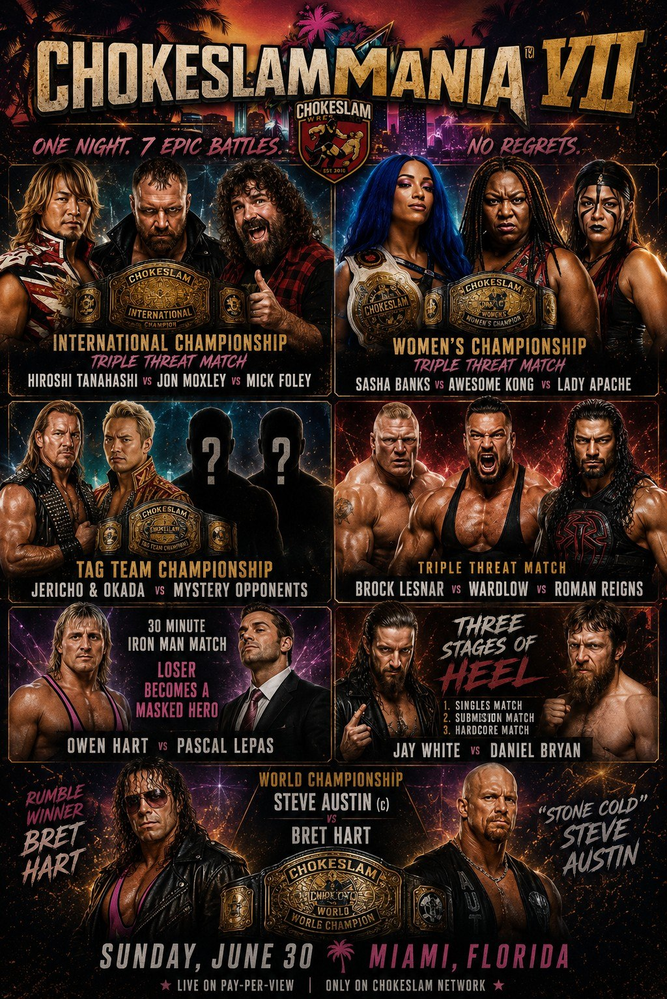
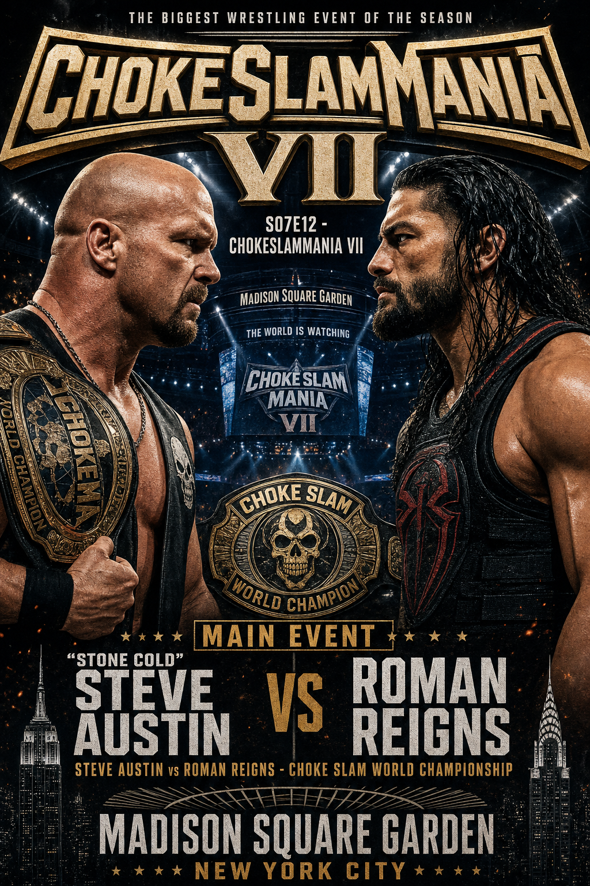

# 

  
  

**S07E12_ChokeSlamMania VII**

**Date:** 2026-06-23

**Venue:** Madison Square Garden - New York, New York, USA

## Matches

| Nr. | Type | Match | Finish | Time | Rating | Score |
|-----|------|-------|--------|------|--------|-------|
| 1 |  | Three Stages of Hell - Singles: [[Wrestler/Daniel Bryan\|Daniel Bryan]] vs. [[Wrestler/Jay White\|Jay White]] | Jay White beat Daniel Bryan in 21 Min 50 Sec with a Blade Runner | 21:50 | ★★★¾ | 80 |
| 2 | Submission | Three Stages of Hell - Submission: [[Wrestler/Daniel Bryan\|Daniel Bryan]] vs. [[Wrestler/Jay White\|Jay White]] | Jay White beat Daniel Bryan in 7 Min 44 Sec with a K.O | 7:44 | ★ | 54 |
| 3 |  | [[Wrestler/Brock Lesnar\|Brock Lesnar]] vs. [[Wrestler/Wardlow\|Wardlow]] vs. [[Wrestler/Roman Reigns\|Roman Reigns]] | Brock Lesnar won a triple threat match against Wardlow & Roman Reigns in  22:10 | 22:10 | ★★★¾ | 83 |
| 4 |  | [[Choke Slam International Championship]]: [[Wrestler/Mick Foley\|Mick Foley]] vs. [[Wrestler/Jon Moxley\|Jon Moxley]] vs. [[Wrestler/Hiroshi Tanahashi\|Hiroshi Tanahashi]] (c) | Hiroshi Tanahashi won a triple threat match against Mick Foley & Jon Moxley in  15:04 | 15:04 | ★★★★ | 84 |
| 5 |  | [[Choke Slam World Championship]]: [[Wrestler/Bret Hart\|Bret Hart]] vs. [[Wrestler/Steve Austin\|Steve Austin]] (c) | Steve Austin beat Bret Hart in 16 Min 6 Sec with a Stone Cold Stunner | 16:06 | ★★★★¼ | 90 |
| 6 |  | [[Choke Slam Womens Championship]]: [[Wrestler/Awesome Kong\|Awesome Kong]] vs. [[Wrestler/Lady Apache\|Lady Apache]] vs. [[Wrestler/Sasha Banks\|Sasha Banks]] (c) | Sasha Banks won a triple threat match against Awesome Kong & Lady Apache in  31:09 | 31:09 | ★★★★¾ | 96 |
| 7 | Tag Team | [[Choke Slam Tag Team Championship]]: Sweet 'n Sour Allstars vs. [[Teams/Saint Rebel Radicalz\|Saint Rebel Radicalz]] (c) | Bam Bam Bigelow beat Chris Jericho in 13 Min 27 Sec with a Greetings from Asbury Park | 13:27 | ★★★★ | 86 |
| 8 |  | Gauntlet: [[Teams/Militanter Mummenschanz\|Militanter Mummenschanz]] Allstars vs.- [[Teams/Saint Rebel Radicalz\|Saint Rebel Radicalz]] Allstars | Triple H and 9 other Wrestlers beat Philipp Brunckovic and 9 other Wrestlers in 102 Min 21 Sec with a Pedigree | 102:21 | ★★★★½ | 94 |
| 9 | Iron Man | 30 Minute [[Iron Man]] Match: [[Wrestler/Owen Hart\|Owen Hart]] vs. [[Wrestler/Pascal LePas\|Pascal LePas]] | Owen Hart beat Pascal LePas with 2:0 Falls | 30:00 | ★★★★ | 84 |
| 10 |  | [[Choke Slam World Championship]]: [[Wrestler/Roman Reigns\|Roman Reigns]] vs. [[Wrestler/Steve Austin\|Steve Austin]] (c) | Steve Austin beat Roman Reigns in 25 Min 54 Sec with a Boston Crab | 25:54 | ★★★★ | 85 |

## Links
- [[Events\|📅 Alle Events]]
- [[Wrestler\|🤼 Roster & Stats]]
