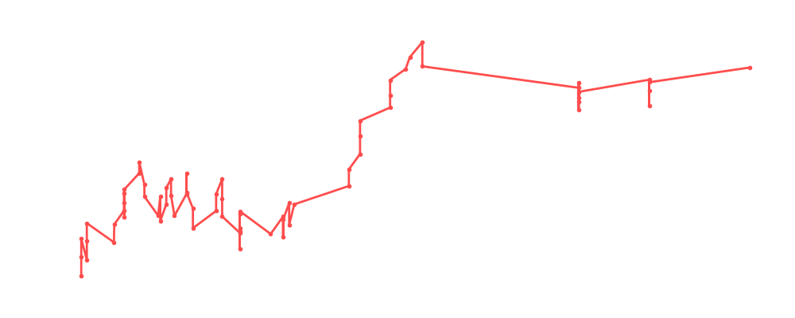

# Bob Backlund

<table><tr><td></td><td><b>Height:</b> 185cm <b>Weight:</b> 109kg <b>Finisher:</b> Crossface Chickenwing <b>Elo Rating:</b> 1363</td></tr></table>

## Karriere-Statistiken
| Matches | Siege | Niederlagen | Draws | Win % | Ø Rating | Elo |
|---|---|---|---|---|---|---|
| 83 | 45 | 26 | 12 | 54.2% | 89.02 | 1363 |

### 📈 Elo History

## Häufigste Gegner
- [[Wrestler/Big Van Vader\|Big Van Vader]] (12x)
- [[Wrestler/Kurt Angle\|Kurt Angle]] (10x)
- [[Wrestler/Shawn Michaels\|Shawn Michaels]] (9x)
- [[Wrestler/Kane\|Kane]] (8x)
- [[Wrestler/Kazuchika Okada\|Kazuchika Okada]] (7x)

## Häufigste Partner
- [[Wrestler/Rey Fenix\|Rey Fenix]] (12x)
- [[Wrestler/Dustin Rhodes\|Dustin Rhodes]] (7x)
- [[Wrestler/Kazuchika Okada\|Kazuchika Okada]] (7x)
- [[Wrestler/Ric Flair\|Ric Flair]] (7x)
- [[Wrestler/EC3\|EC3]] (4x)

## Letzte 5 Matches
- 2025-01-16: [[Teams/Sweet 'n Sour Elite\|Sweet 'n Sour Elite]] vs. [[Wrestler/Bob Backlund\|Bob Backlund]], [[Wrestler/Kazuchika Okada\|Kazuchika Okada]], & [[Wrestler/Rey Fenix\|Rey Fenix]] in [[Events/2025-01-16 - S06E10_RoyalNonstop\|S06E10_RoyalNonstop]] — ✅ Win, 88%
- 2025-01-16: [[Royal Rumble]] in [[Events/2025-01-16 - S06E10_RoyalNonstop\|S06E10_RoyalNonstop]] — 🤝 Draw, 89%
- 2024-05-27: [[Wrestler/Dijak\|Dijak]] vs. [[Wrestler/Bob Backlund\|Bob Backlund]] in [[Events/2024-05-27 - S06E04_Die beste Show der Welt\|S06E04_Die beste Show der Welt]] — ✅ Win, 84%
- 2024-05-27: [[Wrestler/Drew Gulak\|Drew Gulak]] vs. [[Wrestler/Bob Backlund\|Bob Backlund]] in [[Events/2024-05-27 - S06E04_Die beste Show der Welt\|S06E04_Die beste Show der Welt]] — ✅ Win, 92%
- 2024-05-27: [[Wrestler/Tama Tonga\|Tama Tonga]] vs. [[Wrestler/Bob Backlund\|Bob Backlund]] in [[Events/2024-05-27 - S06E04_Die beste Show der Welt\|S06E04_Die beste Show der Welt]] — ❌ Loss, 76%

## Top Matches
- 105%: Dan Koloff HC Tournament: [[Wrestler/Bob Backlund\|Bob Backlund]] vs. [[Wrestler/Hulk Hogan\|Hulk Hogan]] vs. [[Wrestler/Rusev\|Rusev]]  in [[Events/2021-06-30 - S03E12_ChokeSlamMania III - Andre has a posse - Day 1\|S03E12_ChokeSlamMania III - Andre has a posse - Day 1]] (2021-06-30)
- 103%: [[Wrestler/Randy Savage\|Randy Savage]] vs. [[Wrestler/Killer Kelly\|Killer Kelly]] vs. [[Wrestler/Bob Backlund\|Bob Backlund]] in [[Events/2021-10-17 - S04E03_Saudia Arabia - Aftermath\|S04E03_Saudia Arabia - Aftermath]] (2021-10-17)
- 102%: [[Wrestler/Bob Backlund\|Bob Backlund]] vs. [[Wrestler/Fit Finlay\|Fit Finlay]] in [[Events/2020-12-29 - S03E03_Battle of Britain - Night 2\|S03E03_Battle of Britain - Night 2]] (2020-12-29)
- 100%: [[Wrestler/Bob Backlund\|Bob Backlund]] vs. [[Wrestler/Timothy Thatcher\|Timothy Thatcher]] in [[Events/2020-10-13 - S03E01_Choke Slam Carat Gold\|S03E01_Choke Slam Carat Gold]] (2020-10-13)
- 100%: Aerostar & [[Wrestler/Eddie Guerrero\|Eddie Guerrero]] vs. [[Teams/Saint Rebel Radicalz\|Saint Rebel Radicalz]] in [[Events/2020-10-26 - S03E02_World Tag League\|S03E02_World Tag League]] (2020-10-26)
