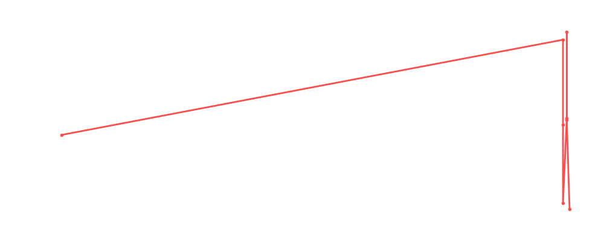

# Charlotte Flair

<table><tr><td></td><td><b>Height:</b> 179cm <b>Weight:</b> 65kg <b>Finisher:</b> Figure 8 Leglock <b>Elo Rating:</b> 1186</td></tr></table>

## Karriere-Statistiken
| Matches | Siege | Niederlagen | Draws | Win % | Ø Rating | Elo |
|---|---|---|---|---|---|---|
| 10 | 3 | 4 | 3 | 30.0% | 88.00 | 1186 |

### 📈 Elo History

## Häufigste Gegner
- [[Wrestler/Awesome Kong\|Awesome Kong]] (3x)
- [[Wrestler/Chris Jericho\|Chris Jericho]] (3x)
- [[Wrestler/Edge\|Edge]] (3x)
- [[Wrestler/Abdullah The Butcher\|Abdullah The Butcher]] (2x)
- [[Wrestler/Jimmy Snuka\|Jimmy Snuka]] (2x)

## Häufigste Partner
- [[Wrestler/Fit Finlay\|Fit Finlay]] (2x)
- [[Wrestler/Awesome Kong\|Awesome Kong]] (1x)
- [[Wrestler/Jay White\|Jay White]] (1x)
- [[Wrestler/Bandido\|Bandido]] (1x)
- [[Wrestler/Chris Jericho\|Chris Jericho]] (1x)

## Letzte 5 Matches
- 2025-10-02: [[Wrestler/Lady Apache\|Lady Apache]] vs. [[Wrestler/Jay White\|Jay White]] vs. [[Wrestler/Bandido\|Bandido]] vs. [[Wrestler/Charlotte Flair\|Charlotte Flair]] vs. [[Wrestler/Chris Jericho\|Chris Jericho]] vs. [[Wrestler/Edge\|Edge]] in [[Events/2025-10-02 - S07E04 The Iron Chamber - Night 2\|S07E04 The Iron Chamber - Night 2]] — ❌ Loss, 86%
- 2025-08-12: Womens Quarter Finals: [[Wrestler/Charlotte Flair\|Charlotte Flair]] vs. [[Wrestler/Lady Apache\|Lady Apache]] in [[Events/2025-08-12 - S07E02_King & Queen of the Ring\|S07E02_King & Queen of the Ring]] — ✅ Win, 84%
- 2025-08-12: Womens Semi Finals: [[Wrestler/Awesome Kong\|Awesome Kong]] vs. [[Wrestler/Charlotte Flair\|Charlotte Flair]] in [[Events/2025-08-12 - S07E02_King & Queen of the Ring\|S07E02_King & Queen of the Ring]] — ✅ Win, 84%
- 2025-08-12: Queen of the Ring Final: [[Wrestler/Charlotte Flair\|Charlotte Flair]] vs. [[Wrestler/Sasha Banks\|Sasha Banks]] in [[Events/2025-08-12 - S07E02_King & Queen of the Ring\|S07E02_King & Queen of the Ring]] — ❌ Loss, 91%
- 2025-06-03: Reveal Rumble in [[Events/2025-06-03 - S07E01_Brave new World\|S07E01_Brave new World]] — 🤝 Draw, 100%

## Top Matches
- 100%: Reveal Rumble in [[Events/2025-06-03 - S07E01_Brave new World\|S07E01_Brave new World]] (2025-06-03)
- 98%: [[Street Fight]]: [[Teams/Militanter Mummenschanz\|Militanter Mummenschanz]] vs. [[Teams/Sweet 'n Sour Elite\|Sweet 'n Sour Elite]] in [[Events/2025-06-03 - S07E01_Brave new World\|S07E01_Brave new World]] (2025-06-03)
- 91%: Queen of the Ring Final: [[Wrestler/Charlotte Flair\|Charlotte Flair]] vs. [[Wrestler/Sasha Banks\|Sasha Banks]] in [[Events/2025-08-12 - S07E02_King & Queen of the Ring\|S07E02_King & Queen of the Ring]] (2025-08-12)
- 90%: Greatest Rumble ever in [[Events/2021-05-18 - S03E10_Saudi Arabia - Blood and The biggest, greatest, most awesome, most fantastic Royal Rumble ever!\|S03E10_Saudi Arabia - Blood and The biggest, greatest, most awesome, most fantastic Royal Rumble ever!]] (2021-05-18)
- 88%: Womens [[Royal Rumble]] in [[Events/2023-02-22 - S05E02_Royal Rumble\|S05E02_Royal Rumble]] (2023-02-22)
