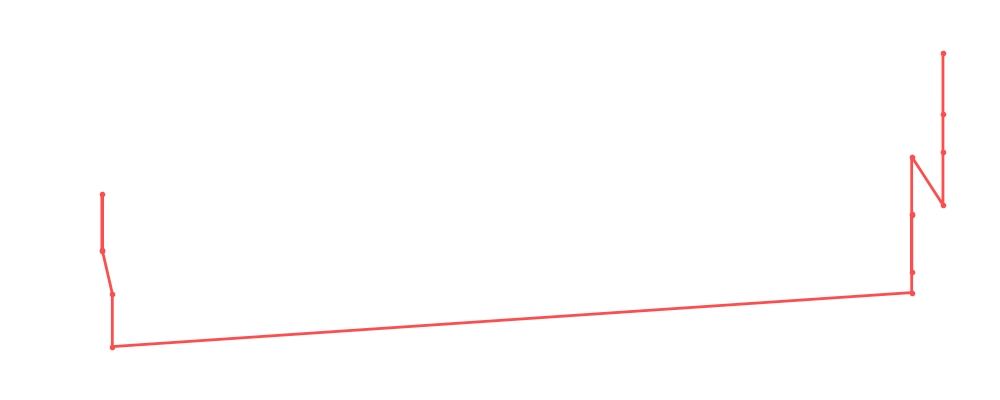

# Claudio Castagnoli

<table><tr><td></td><td><b>Height:</b> 195cm <b>Weight:</b> 105kg <b>Finisher:</b> Ricola Bomb <b>Elo Rating:</b> 1243</td></tr></table>

## Karriere-Statistiken
| Matches | Siege | Niederlagen | Draws | Win % | Ø Rating | Elo |
|---|---|---|---|---|---|---|
| 16 | 8 | 6 | 2 | 50.0% | 82.56 | 1243 |

### 📈 Elo History

## Häufigste Gegner
- [[Wrestler/Rey Mysterio Jr.\|Rey Mysterio Jr.]] (4x)
- [[Wrestler/Aoife Valkyrie\|Aoife Valkyrie]] (3x)
- [[Wrestler/Randy Savage\|Randy Savage]] (3x)
- [[Wrestler/Bob Backlund\|Bob Backlund]] (3x)
- [[Wrestler/Killer Kelly\|Killer Kelly]] (3x)

## Häufigste Partner
- [[Wrestler/Pac\|Pac]] (4x)
- [[Wrestler/Consequences Creed\|Consequences Creed]] (2x)
- [[Wrestler/Ricky Steamboat\|Ricky Steamboat]] (1x)
- [[Wrestler/Bob Backlund\|Bob Backlund]] (1x)
- [[Wrestler/Big Kon\|Big Kon]] (1x)

## Letzte 5 Matches
- 2024-10-22: Angelico & [[Wrestler/Ivelisse\|Ivelisse]] vs. [[Wrestler/Claudio Castagnoli\|Claudio Castagnoli]] & [[Wrestler/Pac\|Pac]] in [[Events/2024-10-22 - S06E07_Turbo Turnier\|S06E07_Turbo Turnier]] — ✅ Win, 88%
- 2024-10-22: [[Wrestler/Claudio Castagnoli\|Claudio Castagnoli]] & [[Wrestler/Pac\|Pac]] vs. [[Wrestler/Killer Kelly\|Killer Kelly]] & [[Wrestler/Dalton Castle\|Dalton Castle]] in [[Events/2024-10-22 - S06E07_Turbo Turnier\|S06E07_Turbo Turnier]] — ✅ Win, 81%
- 2024-10-22: [[Teams/Path of God\|Path of God]] vs. [[Wrestler/Claudio Castagnoli\|Claudio Castagnoli]] & [[Wrestler/Pac\|Pac]] in [[Events/2024-10-22 - S06E07_Turbo Turnier\|S06E07_Turbo Turnier]] — ✅ Win, 90%
- 2024-10-22: [[Wrestler/Claudio Castagnoli\|Claudio Castagnoli]] & [[Wrestler/Pac\|Pac]] vs. [[Teams/Sweet 'n Sour Elite\|Sweet 'n Sour Elite]] in [[Events/2024-10-22 - S06E07_Turbo Turnier\|S06E07_Turbo Turnier]] — ❌ Loss, 81%
- 2024-09-09: B: [[Wrestler/Claudio Castagnoli\|Claudio Castagnoli]] vs. [[Wrestler/Masahiro Chono\|Masahiro Chono]] in [[Events/2024-09-09 - S06E06_G1 Climax - Best of the Rest from the Past\|S06E06_G1 Climax - Best of the Rest from the Past]] — ✅ Win, 59%

## Top Matches
- 99%: [[Teams/Saint Rebel Radicalz\|Saint Rebel Radicalz]] vs. [[Teams/Militanter Mummenschanz\|Militanter Mummenschanz]] in [[Events/2021-08-23 - S04E01_90's\|S04E01_90's]] (2021-08-23)
- 94%: [[Teams/Militanter Mummenschanz\|Militanter Mummenschanz]] vs. [[Teams/Sweet 'n Sour Elite\|Sweet 'n Sour Elite]] in [[Events/2021-08-23 - S04E01_90's\|S04E01_90's]] (2021-08-23)
- 93%: 1/4 Finals: [[Wrestler/Claudio Castagnoli\|Claudio Castagnoli]] vs. [[Wrestler/Kensuke Sasaki\|Kensuke Sasaki]] in [[Events/2024-09-09 - S06E06_G1 Climax - Best of the Rest from the Past\|S06E06_G1 Climax - Best of the Rest from the Past]] (2024-09-09)
- 91%: The Greatest [[Royal Rumble]] in [[Events/2021-10-17 - S04E03_Saudi Arabia\|S04E03_Saudi Arabia]] (2021-10-17)
- 90%: [[Teams/Path of God\|Path of God]] vs. [[Wrestler/Claudio Castagnoli\|Claudio Castagnoli]] & [[Wrestler/Pac\|Pac]] in [[Events/2024-10-22 - S06E07_Turbo Turnier\|S06E07_Turbo Turnier]] (2024-10-22)
