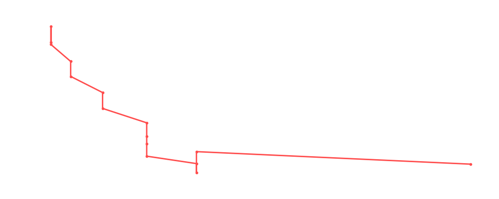

# Drew Gulak

<table><tr><td></td><td><b>Height:</b> N/A <b>Weight:</b> N/A <b>Finisher:</b> N/A <b>Elo Rating:</b> 1095</td></tr></table>

## Karriere-Statistiken
| Matches | Siege | Niederlagen | Draws | Win % | Ø Rating | Elo |
|---|---|---|---|---|---|---|
| 17 | 3 | 12 | 2 | 17.6% | 79.18 | 1095 |

### 📈 Elo History

## Häufigste Gegner
- [[Wrestler/Jordynne Grace\|Jordynne Grace]] (3x)
- [[Wrestler/Jun Akiyama\|Jun Akiyama]] (3x)
- [[Wrestler/Triple H\|Triple H]] (3x)
- [[Wrestler/AJ Styles\|AJ Styles]] (2x)
- [[Wrestler/Big Kon\|Big Kon]] (2x)

## Häufigste Partner
- [[Wrestler/Masha Slamovich\|Masha Slamovich]] (4x)
- [[Wrestler/Dusty Rhodes\|Dusty Rhodes]] (4x)
- [[Wrestler/Mansoor\|Mansoor]] (1x)

## Letzte 5 Matches
- 2025-05-07: [[Wrestler/Drew Gulak\|Drew Gulak]] & [[Wrestler/Mansoor\|Mansoor]] vs. [[Wrestler/Diesel\|Diesel]] & [[Wrestler/AJ Styles\|AJ Styles]] in [[Events/2025-05-07 - S06E12_ChokeSlamMania VI\|S06E12_ChokeSlamMania VI]] — ❌ Loss, 92%
- 2024-07-19: South West Division: [[Wrestler/Drew Gulak\|Drew Gulak]] vs. [[Wrestler/The Undertaker\|The Undertaker]] in [[Events/2024-07-19 - S06E05_Super Bowl of Wrestling\|S06E05_Super Bowl of Wrestling]] — ❌ Loss, 55%
- 2024-07-19: South West Division: [[Wrestler/Kairi Sane\|Kairi Sane]] vs. [[Wrestler/Drew Gulak\|Drew Gulak]] in [[Events/2024-07-19 - S06E05_Super Bowl of Wrestling\|S06E05_Super Bowl of Wrestling]] — ✅ Win, 74%
- 2024-07-19: South West Division: [[Wrestler/Drew Gulak\|Drew Gulak]] vs. [[Wrestler/Triple H\|Triple H]] in [[Events/2024-07-19 - S06E05_Super Bowl of Wrestling\|S06E05_Super Bowl of Wrestling]] — ❌ Loss, 67%
- 2024-05-27: [[Wrestler/Drew Gulak\|Drew Gulak]] vs. [[Wrestler/Larry Zbyszko\|Larry Zbyszko]] in [[Events/2024-05-27 - S06E04_Die beste Show der Welt\|S06E04_Die beste Show der Welt]] — ❌ Loss, 80%

## Top Matches
- 93%: Rumble in [[Events/2024-02-15 - S06E01_Welcome to Ta'if\|S06E01_Welcome to Ta'if]] (2024-02-15)
- 93%: [[Wrestler/Drew Gulak\|Drew Gulak]] vs. [[Wrestler/Dusty Rhodes\|Dusty Rhodes]] in [[Events/2024-04-10 - S06E03_Digital Domination: Unleash the Choke Slam Fury!\|S06E03_Digital Domination: Unleash the Choke Slam Fury!]] (2024-04-10)
- 92%: [[Wrestler/Drew Gulak\|Drew Gulak]] vs. [[Wrestler/Bob Backlund\|Bob Backlund]] in [[Events/2024-05-27 - S06E04_Die beste Show der Welt\|S06E04_Die beste Show der Welt]] (2024-05-27)
- 92%: [[Wrestler/Drew Gulak\|Drew Gulak]] & [[Wrestler/Mansoor\|Mansoor]] vs. [[Wrestler/Diesel\|Diesel]] & [[Wrestler/AJ Styles\|AJ Styles]] in [[Events/2025-05-07 - S06E12_ChokeSlamMania VI\|S06E12_ChokeSlamMania VI]] (2025-05-07)
- 88%: [[Wrestler/Drew Gulak\|Drew Gulak]] vs. [[Wrestler/Seth Rollins\|Seth Rollins]] in [[Events/2024-05-27 - S06E04_Die beste Show der Welt\|S06E04_Die beste Show der Welt]] (2024-05-27)
