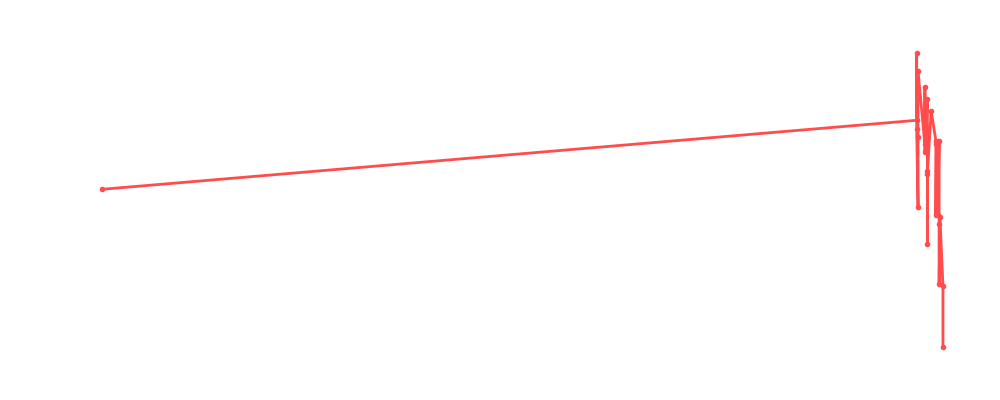

# Dustin Rhodes

<table><tr><td></td><td><b>Height:</b> 199cm <b>Weight:</b> 107kg <b>Finisher:</b> Powerslam B <b>Elo Rating:</b> 1163</td></tr></table>

## Karriere-Statistiken
| Matches | Siege | Niederlagen | Draws | Win % | Ø Rating | Elo |
|---|---|---|---|---|---|---|
| 28 | 11 | 13 | 4 | 39.3% | 88.07 | 1163 |

### 📈 Elo History

## Häufigste Gegner
- [[Wrestler/Kane\|Kane]] (5x)
- [[Wrestler/Tetsuya Naito\|Tetsuya Naito]] (5x)
- [[Wrestler/Kazuchika Okada\|Kazuchika Okada]] (5x)
- [[Wrestler/Dr. Wagner Jr.\|Dr. Wagner Jr.]] (4x)
- [[Wrestler/Kurt Angle\|Kurt Angle]] (4x)

## Häufigste Partner
- [[Wrestler/Rey Fenix\|Rey Fenix]] (9x)
- [[Wrestler/Bob Backlund\|Bob Backlund]] (7x)
- [[Wrestler/Madison Rayne\|Madison Rayne]] (5x)
- [[Wrestler/Kazuchika Okada\|Kazuchika Okada]] (4x)
- [[Wrestler/Randy Savage\|Randy Savage]] (4x)

## Letzte 5 Matches
- 2023-12-15: [[Wrestler/EC3\|EC3]] vs. [[Wrestler/Big Van Vader\|Big Van Vader]] vs. [[Wrestler/Brutus Beefcake\|Brutus Beefcake]] vs. [[Wrestler/Tetsuya Naito\|Tetsuya Naito]] vs. [[Wrestler/Ivelisse\|Ivelisse]] vs. [[Wrestler/Tommy End\|Tommy End]] vs. [[Wrestler/Bob Backlund\|Bob Backlund]] vs. [[Wrestler/Sting\|Sting]] in [[Events/2023-12-15 - S05E11_Tournament Nonstop Action\|S05E11_Tournament Nonstop Action]] — 🤝 Draw, 88%
- 2021-10-17: The Greatest [[Royal Rumble]] in [[Events/2021-10-17 - S04E03_Saudi Arabia\|S04E03_Saudi Arabia]] — 🤝 Draw, 91%
- 2021-06-15: Money in the Bank: [[Wrestler/Kane\|Kane]] vs. [[Wrestler/Awesome Kong\|Awesome Kong]] vs. [[Wrestler/Christian Cage\|Christian Cage]] vs. [[Wrestler/Tetsuya Naito\|Tetsuya Naito]] vs. [[Wrestler/Randy Savage\|Randy Savage]] vs. Dusty Rhodes in [[Events/2021-06-15 - S03E11_Sûper Canada!\|S03E11_Sûper Canada!]] — ❌ Loss, 99%
- 2021-06-15: [[Wrestler/Kane\|Kane]] vs. [[Wrestler/Awesome Kong\|Awesome Kong]] vs. [[Wrestler/Madison Rayne\|Madison Rayne]] vs. [[Wrestler/Dustin Rhodes\|Dustin Rhodes]] vs. [[Wrestler/Hulk Hogan\|Hulk Hogan]] vs. [[Wrestler/Tetsuya Naito\|Tetsuya Naito]] in [[Events/2021-06-15 - S03E11_Sûper Canada!\|S03E11_Sûper Canada!]] — ❌ Loss, 88%
- 2021-05-18: [[Wrestler/Dustin Rhodes\|Dustin Rhodes]] vs. [[Wrestler/The Sheik\|The Sheik]] in [[Events/2021-05-18 - S03E10_Saudi Arabia - Blood and The biggest, greatest, most awesome, most fantastic Royal Rumble ever!\|S03E10_Saudi Arabia - Blood and The biggest, greatest, most awesome, most fantastic Royal Rumble ever!]] — ✅ Win, 70%

## Top Matches
- 100%: Aerostar & [[Wrestler/Eddie Guerrero\|Eddie Guerrero]] vs. [[Teams/Saint Rebel Radicalz\|Saint Rebel Radicalz]] in [[Events/2020-10-26 - S03E02_World Tag League\|S03E02_World Tag League]] (2020-10-26)
- 100%: [[Teams/Saint Rebel Radicalz\|Saint Rebel Radicalz]] vs. [[Wrestler/Davey Boy Smith\|Davey Boy Smith]] & [[Wrestler/Dynamite Kid\|Dynamite Kid]] in [[Events/2020-12-28 - S03E03_Battle of Britain - Night 1\|S03E03_Battle of Britain - Night 1]] (2020-12-28)
- 100%: [[Teams/Saint Rebel Radicalz\|Saint Rebel Radicalz]] vs. [[Wrestler/Cheeseburger\|Cheeseburger]] & [[Wrestler/Al Snow\|Al Snow]] in [[Events/2021-02-25 - S03E06_Swiss Bliss\|S03E06_Swiss Bliss]] (2021-02-25)
- 100%: [[Wrestler/Mark Davis\|Mark Davis]] & [[Wrestler/Kyle Fletcher\|Kyle Fletcher]] vs. [[Teams/Saint Rebel Radicalz\|Saint Rebel Radicalz]] in [[Events/2021-04-10 - S03E07_Aussie Open Resurrection\|S03E07_Aussie Open Resurrection]] (2021-04-10)
- 100%: [[Wrestler/Edge\|Edge]] vs. [[Wrestler/KENTA\|KENTA]] vs. [[Wrestler/Kenny Omega\|Kenny Omega]] vs. [[Wrestler/Christian\|Christian]] vs. [[Wrestler/Dustin Rhodes\|Dustin Rhodes]] vs. [[Wrestler/Kazuchika Okada\|Kazuchika Okada]] in [[Events/2021-04-10 - S03E07_Aussie Open Resurrection\|S03E07_Aussie Open Resurrection]] (2021-04-10)
