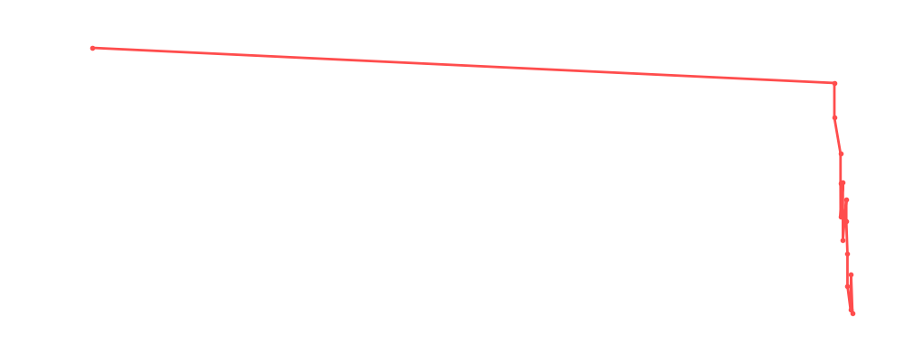

# Gail Kim

<table><tr><td></td><td><b>Height:</b> N/A <b>Weight:</b> N/A <b>Finisher:</b> N/A <b>Elo Rating:</b> 1078</td></tr></table>

## Karriere-Statistiken
| Matches | Siege | Niederlagen | Draws | Win % | Ø Rating | Elo |
|---|---|---|---|---|---|---|
| 17 | 3 | 12 | 2 | 17.6% | 85.24 | 1078 |

### 📈 Elo History

## Häufigste Gegner
- [[Wrestler/Bob Backlund\|Bob Backlund]] (3x)
- [[Wrestler/Dustin Rhodes\|Dustin Rhodes]] (3x)
- [[Wrestler/Dr. Wagner Jr.\|Dr. Wagner Jr.]] (2x)
- [[Wrestler/Jushin Liger\|Jushin Liger]] (2x)
- [[Wrestler/KENTA\|KENTA]] (2x)

## Häufigste Partner
- [[Wrestler/Barry Windham\|Barry Windham]] (2x)
- [[Wrestler/Bob Backlund\|Bob Backlund]] (2x)
- [[Wrestler/Rey Fenix\|Rey Fenix]] (2x)
- [[Wrestler/Dustin Rhodes\|Dustin Rhodes]] (2x)
- [[Wrestler/Kazuchika Okada\|Kazuchika Okada]] (1x)

## Letzte 5 Matches
- 2023-12-15: [[Wrestler/EC3\|EC3]] vs. [[Wrestler/Big Van Vader\|Big Van Vader]] vs. [[Wrestler/Brutus Beefcake\|Brutus Beefcake]] vs. [[Wrestler/Tetsuya Naito\|Tetsuya Naito]] vs. [[Wrestler/Ivelisse\|Ivelisse]] vs. [[Wrestler/Tommy End\|Tommy End]] vs. [[Wrestler/Bob Backlund\|Bob Backlund]] vs. [[Wrestler/Sting\|Sting]] in [[Events/2023-12-15 - S05E11_Tournament Nonstop Action\|S05E11_Tournament Nonstop Action]] — 🤝 Draw, 88%
- 2021-04-29: [[Teams/Saint Rebel Radicalz\|Saint Rebel Radicalz]] vs. [[Wrestler/Lex Luger\|Lex Luger]] & [[Wrestler/Kurt Angle\|Kurt Angle]] in [[Events/2021-04-29 - S03E09_USA - Day 1 - Cool, Cooler, Icecold\|S03E09_USA - Day 1 - Cool, Cooler, Icecold]] — ❌ Loss, 100%
- 2021-04-15: [[Teams/Saint Rebel Radicalz\|Saint Rebel Radicalz]] vs. Mexicans in [[Events/2021-04-15 - S03E08_BYOC Fiesta Mexicana\|S03E08_BYOC Fiesta Mexicana]] — ✅ Win, 92%
- 2021-04-15: [[Wrestler/Texano\|Texano]] Jr. vs. [[Wrestler/Gail Kim\|Gail Kim]] vs. [[Wrestler/Johnny Mundo\|Johnny Mundo]] vs. [[Wrestler/Shingo Takagi\|Shingo Takagi]] vs. [[Wrestler/Daga\|Daga]]  vs. [[Wrestler/Dustin Rhodes\|Dustin Rhodes]] vs. [[Wrestler/Kazuchika Okada\|Kazuchika Okada]] vs. [[Wrestler/Taya Valkyrie\|Taya Valkyrie]] in [[Events/2021-04-15 - S03E08_BYOC Fiesta Mexicana\|S03E08_BYOC Fiesta Mexicana]] — 🤝 Draw, 91%
- 2021-04-10: [[Wrestler/Rhea Ripley\|Rhea Ripley]] vs. [[Wrestler/Gail Kim\|Gail Kim]] in [[Events/2021-04-10 - S03E07_Aussie Open Resurrection\|S03E07_Aussie Open Resurrection]] — ❌ Loss, 80%

## Top Matches
- 100%: Aerostar & [[Wrestler/Eddie Guerrero\|Eddie Guerrero]] vs. [[Wrestler/Barry Windham\|Barry Windham]] & [[Wrestler/Gail Kim\|Gail Kim]] in [[Events/2020-10-26 - S03E02_World Tag League\|S03E02_World Tag League]] (2020-10-26)
- 100%: [[Teams/Saint Rebel Radicalz\|Saint Rebel Radicalz]] vs. [[Wrestler/Lex Luger\|Lex Luger]] & [[Wrestler/Kurt Angle\|Kurt Angle]] in [[Events/2021-04-29 - S03E09_USA - Day 1 - Cool, Cooler, Icecold\|S03E09_USA - Day 1 - Cool, Cooler, Icecold]] (2021-04-29)
- 99%: [[Wrestler/Barry Windham\|Barry Windham]] & [[Wrestler/Gail Kim\|Gail Kim]] vs. [[Teams/Saint Rebel Radicalz\|Saint Rebel Radicalz]] in [[Events/2020-10-26 - S03E02_World Tag League\|S03E02_World Tag League]] (2020-10-26)
- 94%: [[Teams/Saint Rebel Radicalz\|Saint Rebel Radicalz]] vs. [[Wrestler/Mark Andrews\|Mark Andrews]] & [[Wrestler/Flash Morgan Webster\|Flash Morgan Webster]] in [[Events/2020-12-29 - S03E03_Battle of Britain - Night 2\|S03E03_Battle of Britain - Night 2]] (2020-12-29)
- 92%: [[Teams/Saint Rebel Radicalz\|Saint Rebel Radicalz]] vs. Mexicans in [[Events/2021-04-15 - S03E08_BYOC Fiesta Mexicana\|S03E08_BYOC Fiesta Mexicana]] (2021-04-15)
