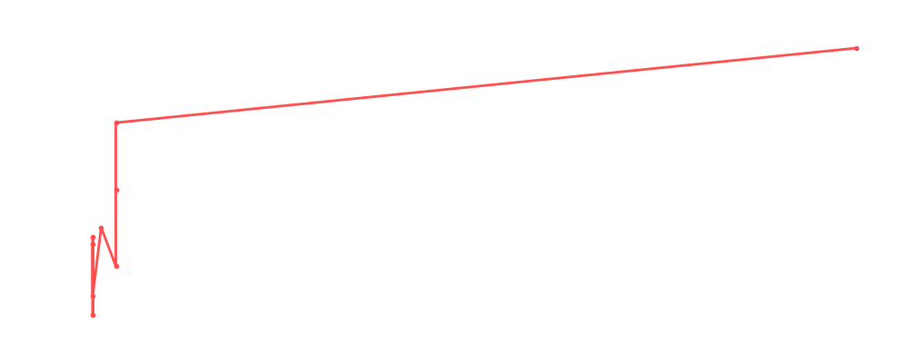

# Jeff Cobb

<table><tr><td></td><td><b>Height:</b> 179cm <b>Weight:</b> 129kg <b>Finisher:</b> Tour of the Islands <b>Elo Rating:</b> 1231</td></tr></table>

## Karriere-Statistiken
| Matches | Siege | Niederlagen | Draws | Win % | Ø Rating | Elo |
|---|---|---|---|---|---|---|
| 11 | 5 | 4 | 2 | 45.5% | 84.73 | 1231 |

### 📈 Elo History

## Häufigste Gegner
- [[Wrestler/Hiromu Takahashi\|Hiromu Takahashi]] (3x)
- [[Wrestler/Awesome Kong\|Awesome Kong]] (3x)
- [[Wrestler/Johnny Mundo\|Johnny Mundo]] (3x)
- [[Wrestler/The Butcher\|The Butcher]] (3x)
- [[Wrestler/Abdullah The Butcher\|Abdullah The Butcher]] (2x)

## Häufigste Partner
- [[Wrestler/Bob Backlund\|Bob Backlund]] (1x)
- [[Wrestler/The Blade\|The Blade]] (1x)
- [[Wrestler/Kazuchika Okada\|Kazuchika Okada]] (1x)
- [[Wrestler/Ultimate Warrior\|Ultimate Warrior]] (1x)

## Letzte 5 Matches
- 2025-03-03: [[Teams/Saint Rebel Radicalz\|Saint Rebel Radicalz]] vs. [[Wrestler/Jeff Cobb\|Jeff Cobb]] & [[Wrestler/Ultimate Warrior\|Ultimate Warrior]] in [[Events/2025-03-03 - S06E11_Sweet but Psycho\|S06E11_Sweet but Psycho]] — ✅ Win, 85%
- 2021-07-26: Dan Koloff HC Tournament: [[Wrestler/Awesome Kong\|Awesome Kong]] ( /[[Wrestler/Paul Heyman\|Paul Heyman]]) vs. [[Wrestler/Jeff Cobb\|Jeff Cobb]] (E/[[Wrestler/dge\|dge]]) in [[Events/2021-07-26 - S03E12_ChokeSlamMania III - Andre has a posse - Day 2\|S03E12_ChokeSlamMania III - Andre has a posse - Day 2]] — ✅ Win, 76%
- 2021-07-26: Dan Koloff HC Tournament 1/2 Finals: [[Wrestler/Jeff Cobb\|Jeff Cobb]] (E/[[Wrestler/dge\|dge]]) vs. [[Wrestler/The Butcher\|The Butcher]] in [[Events/2021-07-26 - S03E12_ChokeSlamMania III - Andre has a posse - Day 2\|S03E12_ChokeSlamMania III - Andre has a posse - Day 2]] — ✅ Win, 88%
- 2021-07-26: Dan Koloff HC Tournament Finals:[[Wrestler/Johnny Mundo\|Johnny Mundo]] vs. [[Wrestler/Jeff Cobb\|Jeff Cobb]] in [[Events/2021-07-26 - S03E12_ChokeSlamMania III - Andre has a posse - Day 2\|S03E12_ChokeSlamMania III - Andre has a posse - Day 2]] — ❌ Loss, 76%
- 2021-06-30: Andre the Giant Memorial [[Battle Royal]] in [[Events/2021-06-30 - S03E12_ChokeSlamMania III - Andre has a posse - Day 1\|S03E12_ChokeSlamMania III - Andre has a posse - Day 1]] — 🤝 Draw, 89%

## Top Matches
- 100%: Pre Show: [[Wrestler/Brutus Beefcake\|Brutus Beefcake]] vs. [[Wrestler/Jeff Cobb\|Jeff Cobb]] in [[Events/2021-06-15 - S03E11_Sûper Canada!\|S03E11_Sûper Canada!]] (2021-06-15)
- 99%: [[Wrestler/Bob Backlund\|Bob Backlund]] & [[Wrestler/Jeff Cobb\|Jeff Cobb]] vs. [[Wrestler/The Butcher\|The Butcher]] & [[Wrestler/Kazuchika Okada\|Kazuchika Okada]] in [[Events/2021-06-15 - S03E11_Sûper Canada!\|S03E11_Sûper Canada!]] (2021-06-15)
- 91%: [[Wrestler/Owen Hart\|Owen Hart]] & [[Wrestler/Hiromu Takahashi\|Hiromu Takahashi]] vs. [[Teams/Sweet 'n Sour Elite\|Sweet 'n Sour Elite]] in [[Events/2021-06-15 - S03E11_Sûper Canada!\|S03E11_Sûper Canada!]] (2021-06-15)
- 90%: Greatest Rumble ever in [[Events/2021-05-18 - S03E10_Saudi Arabia - Blood and The biggest, greatest, most awesome, most fantastic Royal Rumble ever!\|S03E10_Saudi Arabia - Blood and The biggest, greatest, most awesome, most fantastic Royal Rumble ever!]] (2021-05-18)
- 89%: Andre the Giant Memorial [[Battle Royal]] in [[Events/2021-06-30 - S03E12_ChokeSlamMania III - Andre has a posse - Day 1\|S03E12_ChokeSlamMania III - Andre has a posse - Day 1]] (2021-06-30)
