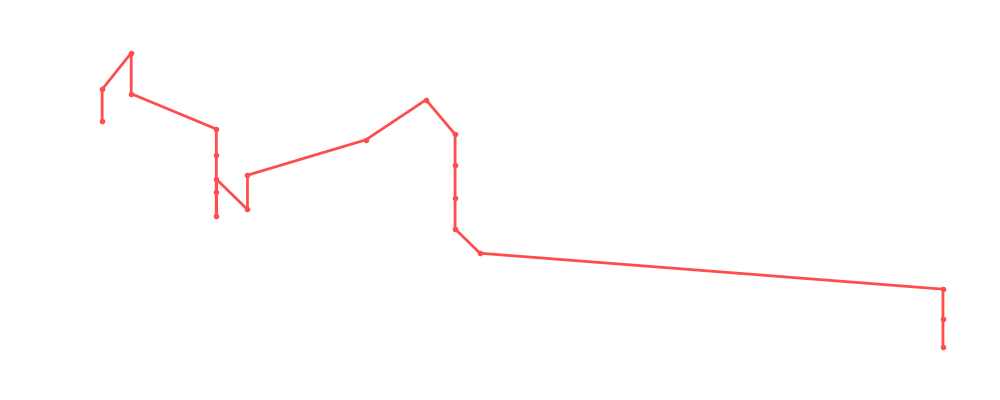

# Jeff Jarrett

<table><tr><td></td><td><b>Height:</b> N/A <b>Weight:</b> N/A <b>Finisher:</b> N/A <b>Elo Rating:</b> 1113</td></tr></table>

## Karriere-Statistiken
| Matches | Siege | Niederlagen | Draws | Win % | Ø Rating | Elo |
|---|---|---|---|---|---|---|
| 24 | 7 | 14 | 3 | 29.2% | 87.71 | 1113 |

### 📈 Elo History

## Häufigste Gegner
- [[Wrestler/Christian Cage\|Christian Cage]] (6x)
- [[Wrestler/Tetsuya Naito\|Tetsuya Naito]] (3x)
- [[Wrestler/Madison Rayne\|Madison Rayne]] (3x)
- [[Wrestler/Bob Backlund\|Bob Backlund]] (3x)
- [[Wrestler/Chris Hero\|Chris Hero]] (3x)

## Häufigste Partner
- [[Wrestler/Killer Kelly\|Killer Kelly]] (9x)
- [[Wrestler/Freddie Mercury\|Freddie Mercury]] (3x)
- [[Wrestler/The Honky Tonk Man\|The Honky Tonk Man]] (3x)
- [[Wrestler/Consequences Creed\|Consequences Creed]] (1x)
- [[Wrestler/Larry Zbyszko\|Larry Zbyszko]] (1x)

## Letzte 5 Matches
- 2025-06-03: Reveal Rumble in [[Events/2025-06-03 - S07E01_Brave new World\|S07E01_Brave new World]] — 🤝 Draw, 100%
- 2022-10-02: Apple Gauntlet 1 in [[Events/2022-10-02 - S04E11_Musik\|S04E11_Musik]] — ❌ Loss, 97%
- 2022-10-02: Apple Gauntlet 2 in [[Events/2022-10-02 - S04E11_Musik\|S04E11_Musik]] — ❌ Loss, 97%
- 2022-10-02: Apple Gauntlet 3 in [[Events/2022-10-02 - S04E11_Musik\|S04E11_Musik]] — ❌ Loss, 97%
- 2022-02-21: [[Wrestler/Jeff Jarrett\|Jeff Jarrett]] & [[Wrestler/Killer Kelly\|Killer Kelly]] vs. The Rockers vs. [[Wrestler/Christian Cage\|Christian Cage]] &.[[Wrestler/Tetsuya Naito\|Tetsuya Naito]] (c) in [[Events/2022-02-21 - S04E08_Fan Favourites\|S04E08_Fan Favourites]] — ❌ Loss, 93%

## Top Matches
- 101%: Trash TV: [[Teams/Militanter Mummenschanz\|Militanter Mummenschanz]] vs. [[Teams/Sweet 'n Sour Elite\|Sweet 'n Sour Elite]] in [[Events/2022-02-09 - S04E07_Extreme\|S04E07_Extreme]] (2022-02-09)
- 100%: Reveal Rumble in [[Events/2025-06-03 - S07E01_Brave new World\|S07E01_Brave new World]] (2025-06-03)
- 98%: [[Wrestler/Consequences Creed\|Consequences Creed]] vs. [[Wrestler/Jeff Jarrett\|Jeff Jarrett]] in [[Events/2021-09-06 - S04E02_Money in the Bank (Season 4)\|S04E02_Money in the Bank (Season 4)]] (2021-09-06)
- 98%: [[Teams/Militanter Mummenschanz\|Militanter Mummenschanz]] vs. [[Wrestler/Robert Dreissker\|Robert Dreissker]] & [[Wrestler/WALTER\|WALTER]] in [[Events/2022-01-26 - S04E06_Olympia\|S04E06_Olympia]] (2022-01-26)
- 97%: Apple Gauntlet 1 in [[Events/2022-10-02 - S04E11_Musik\|S04E11_Musik]] (2022-10-02)
