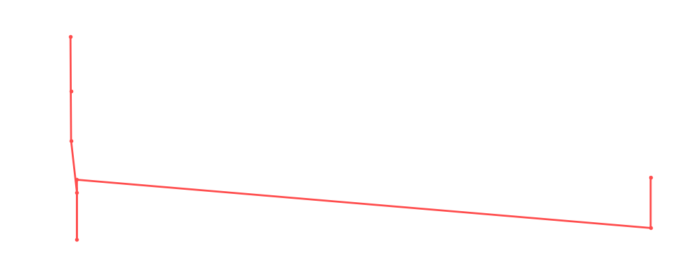

# Jerry Lawler

<table><tr><td></td><td><b>Height:</b> 184cm <b>Weight:</b> 108kg <b>Finisher:</b> Jumping Piledriver <b>Elo Rating:</b> 1173</td></tr></table>

## Karriere-Statistiken
| Matches | Siege | Niederlagen | Draws | Win % | Ø Rating | Elo |
|---|---|---|---|---|---|---|
| 10 | 3 | 5 | 2 | 30.0% | 83.60 | 1173 |

### 📈 Elo History

## Häufigste Gegner
- [[Wrestler/Randy Orton\|Randy Orton]] (4x)
- [[Wrestler/Bam Bam Bigelow\|Bam Bam Bigelow]] (3x)
- [[Wrestler/Dalton Castle\|Dalton Castle]] (2x)
- [[Wrestler/Bret Hart\|Bret Hart]] (2x)
- [[Wrestler/AJ Styles\|AJ Styles]] (2x)

## Häufigste Partner
- [[Wrestler/King Corbin\|King Corbin]] (3x)
- [[Wrestler/Booker T\|Booker T]] (3x)
- [[Wrestler/Sheamus\|Sheamus]] (3x)

## Letzte 5 Matches
- 2025-08-12: 1/8 Finals: [[Wrestler/Jerry Lawler\|Jerry Lawler]] vs. [[Wrestler/Bam Bam Bigelow\|Bam Bam Bigelow]] in [[Events/2025-08-12 - S07E02_King & Queen of the Ring\|S07E02_King & Queen of the Ring]] — ✅ Win, 91%
- 2025-08-12: Quarter Finals: [[Wrestler/Goldust\|Goldust]] vs. [[Wrestler/Jerry Lawler\|Jerry Lawler]] in [[Events/2025-08-12 - S07E02_King & Queen of the Ring\|S07E02_King & Queen of the Ring]] — ❌ Loss, 84%
- 2024-01-29: Big Van Vader Memorial [[Battle Royal]] in [[Events/2024-01-29 - S05E12_ChokeSlamMania V\|S05E12_ChokeSlamMania V]] — 🤝 Draw, 91%
- 2021-05-18: Greatest Rumble ever in [[Events/2021-05-18 - S03E10_Saudi Arabia - Blood and The biggest, greatest, most awesome, most fantastic Royal Rumble ever!\|S03E10_Saudi Arabia - Blood and The biggest, greatest, most awesome, most fantastic Royal Rumble ever!]] — 🤝 Draw, 90%
- 2020-06-29: Kings Court vs. Mummenschanz in [[Events/2020-06-29 - S02E11_Shortcut to Mania\|S02E11_Shortcut to Mania]] — ✅ Win, 71%

## Top Matches
- 92%: [[Choke Slam World Championship]]: [[Wrestler/Randy Orton\|Randy Orton]] vs. [[Wrestler/Jerry Lawler\|Jerry Lawler]] (c) in [[Events/2020-06-10 - S02E10_Dubai - After Show Cash In 2\|S02E10_Dubai - After Show Cash In 2]] (2020-06-10)
- 91%: Big Van Vader Memorial [[Battle Royal]] in [[Events/2024-01-29 - S05E12_ChokeSlamMania V\|S05E12_ChokeSlamMania V]] (2024-01-29)
- 91%: 1/8 Finals: [[Wrestler/Jerry Lawler\|Jerry Lawler]] vs. [[Wrestler/Bam Bam Bigelow\|Bam Bam Bigelow]] in [[Events/2025-08-12 - S07E02_King & Queen of the Ring\|S07E02_King & Queen of the Ring]] (2025-08-12)
- 90%: Greatest Rumble ever in [[Events/2021-05-18 - S03E10_Saudi Arabia - Blood and The biggest, greatest, most awesome, most fantastic Royal Rumble ever!\|S03E10_Saudi Arabia - Blood and The biggest, greatest, most awesome, most fantastic Royal Rumble ever!]] (2021-05-18)
- 85%: [[Choke Slam World Championship]]: [[Wrestler/Randy Orton\|Randy Orton]] vs. [[Wrestler/Jerry Lawler\|Jerry Lawler]] (c) in [[Events/2020-06-09 - S02E10_Dubai - After Show Cash In\|S02E10_Dubai - After Show Cash In]] (2020-06-09)
