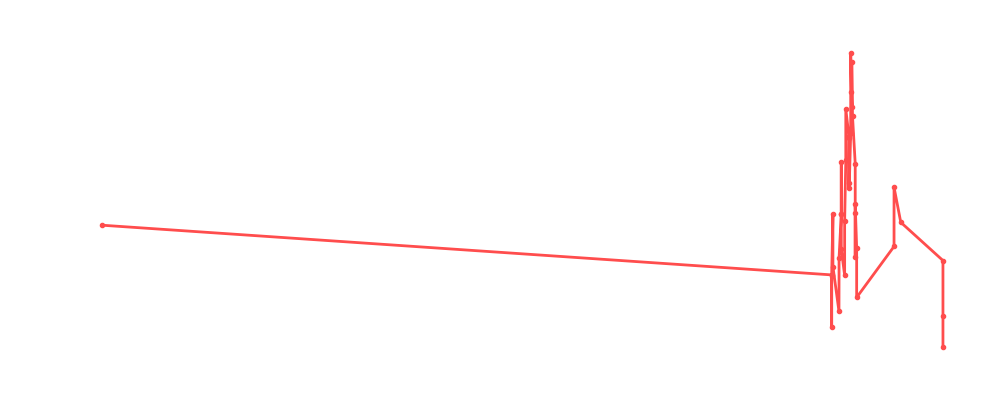

# Kane

<table><tr><td></td><td><b>Height:</b> 213cm <b>Weight:</b> 147kg <b>Finisher:</b> High Angle Chokeslam <b>Elo Rating:</b> 1160</td></tr></table>

## Karriere-Statistiken
| Matches | Siege | Niederlagen | Draws | Win % | Ø Rating | Elo |
|---|---|---|---|---|---|---|
| 46 | 16 | 21 | 9 | 34.8% | 85.72 | 1160 |

### 📈 Elo History

## Häufigste Gegner
- [[Wrestler/Bob Backlund\|Bob Backlund]] (9x)
- [[Wrestler/Tetsuya Naito\|Tetsuya Naito]] (7x)
- [[Wrestler/Kazuchika Okada\|Kazuchika Okada]] (7x)
- [[Wrestler/Christian Cage\|Christian Cage]] (7x)
- [[Wrestler/Rey Fenix\|Rey Fenix]] (6x)

## Häufigste Partner
- [[Wrestler/Jushin Liger\|Jushin Liger]] (6x)
- [[Wrestler/Madison Rayne\|Madison Rayne]] (4x)
- [[Wrestler/Awesome Kong\|Awesome Kong]] (4x)
- [[Wrestler/KENTA\|KENTA]] (3x)
- [[Wrestler/Dustin Rhodes\|Dustin Rhodes]] (3x)

## Letzte 5 Matches
- 2023-12-15: [[Wrestler/AJ Styles\|AJ Styles]] vs. [[Wrestler/Kane\|Kane]] in [[Events/2023-12-15 - S05E11_Tournament Nonstop Action\|S05E11_Tournament Nonstop Action]] — ❌ Loss, 72%
- 2023-12-15: [[Wrestler/Hollywood Hogan\|Hollywood Hogan]] vs. [[Wrestler/Kane\|Kane]] in [[Events/2023-12-15 - S05E11_Tournament Nonstop Action\|S05E11_Tournament Nonstop Action]] — ❌ Loss, 82%
- 2023-12-15: [[Wrestler/Jon Moxley\|Jon Moxley]] vs. [[Wrestler/Kane\|Kane]] in [[Events/2023-12-15 - S05E11_Tournament Nonstop Action\|S05E11_Tournament Nonstop Action]] — ❌ Loss, 83%
- 2022-11-17: [[Choke Slam World Championship]] Elimination Chamber: [[Wrestler/Big Van Vader\|Big Van Vader]] vs. [[Wrestler/Sting\|Sting]] vs. [[Wrestler/Ethan Page\|Ethan Page]] vs. [[Wrestler/Ace Steel\|Ace Steel]] vs. [[Wrestler/Kane\|Kane]] vs. [[Wrestler/WALTER\|WALTER]] vs. [[Wrestler/Bob Backlund\|Bob Backlund]] (c) in [[Events/2022-11-17 - S04E12_ChokeSlamMania IV - Day 2\|S04E12_ChokeSlamMania IV - Day 2]] — 🤝 Draw, 98%
- 2022-10-02: [[Choke Slam World Championship]]: [[Wrestler/Kane\|Kane]] vs. [[Wrestler/Bob Backlund\|Bob Backlund]] (c) in [[Events/2022-10-02 - S04E11_Musik\|S04E11_Musik]] — ❌ Loss, 69%

## Top Matches
- 100%: [[Iron Man]]: [[Teams/Militanter Mummenschanz\|Militanter Mummenschanz]] vs. [[Teams/Sweet 'n Sour Elite\|Sweet 'n Sour Elite]] in [[Events/2021-01-21 - S03E04_Clash of Colosseum\|S03E04_Clash of Colosseum]] (2021-01-21)
- 100%: [[Iron Man]]: [[Teams/Militanter Mummenschanz\|Militanter Mummenschanz]] vs. [[Teams/Saint Rebel Radicalz\|Saint Rebel Radicalz]] in [[Events/2021-01-21 - S03E04_Clash of Colosseum\|S03E04_Clash of Colosseum]] (2021-01-21)
- 100%: [[Teams/Militanter Mummenschanz\|Militanter Mummenschanz]] vs. Mexicans in [[Events/2021-04-15 - S03E08_BYOC Fiesta Mexicana\|S03E08_BYOC Fiesta Mexicana]] (2021-04-15)
- 99%: Money in the Bank: [[Wrestler/Kane\|Kane]] vs. [[Wrestler/Awesome Kong\|Awesome Kong]] vs. [[Wrestler/Christian Cage\|Christian Cage]] vs. [[Wrestler/Tetsuya Naito\|Tetsuya Naito]] vs. [[Wrestler/Randy Savage\|Randy Savage]] vs. Dusty Rhodes in [[Events/2021-06-15 - S03E11_Sûper Canada!\|S03E11_Sûper Canada!]] (2021-06-15)
- 99%: [[Choke Slam Tag Team Championship]]: [[Wrestler/Joey Janela\|Joey Janela]] vs. [[Wrestler/Kane\|Kane]] vs. [[Wrestler/Bob Backlund\|Bob Backlund]] vs. [[Wrestler/Kota Ibushi\|Kota Ibushi]] vs. [[Wrestler/Christian Cage\|Christian Cage]] vs. [[Wrestler/Tetsuya Naito\|Tetsuya Naito]] in [[Events/2021-06-30 - S03E12_ChokeSlamMania III - Andre has a posse - Day 1\|S03E12_ChokeSlamMania III - Andre has a posse - Day 1]] (2021-06-30)
