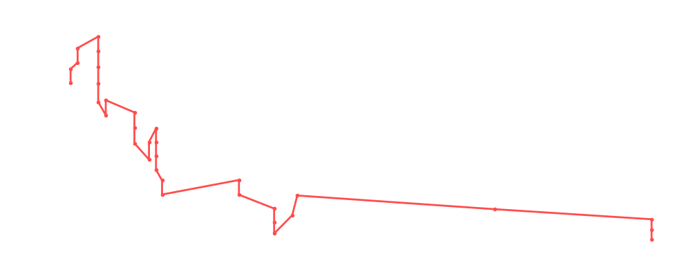

# Killer Kelly

<table><tr><td></td><td><b>Height:</b> N/A <b>Weight:</b> N/A <b>Finisher:</b> N/A <b>Elo Rating:</b> 1051</td></tr></table>

## Karriere-Statistiken
| Matches | Siege | Niederlagen | Draws | Win % | Ø Rating | Elo |
|---|---|---|---|---|---|---|
| 41 | 11 | 22 | 8 | 26.8% | 82.71 | 1051 |

### 📈 Elo History

## Häufigste Gegner
- [[Wrestler/Christian Cage\|Christian Cage]] (8x)
- [[Wrestler/Chris Hero\|Chris Hero]] (7x)
- [[Wrestler/Rush\|Rush]] (7x)
- [[Wrestler/Tetsuya Naito\|Tetsuya Naito]] (6x)
- [[Wrestler/Madison Rayne\|Madison Rayne]] (6x)

## Häufigste Partner
- [[Wrestler/Jeff Jarrett\|Jeff Jarrett]] (9x)
- [[Wrestler/EC3\|EC3]] (6x)
- [[Wrestler/Kevin Steen\|Kevin Steen]] (4x)
- [[Wrestler/Bob Backlund\|Bob Backlund]] (3x)
- [[Wrestler/Dalton Castle\|Dalton Castle]] (3x)

## Letzte 5 Matches
- 2024-10-22: [[Wrestler/Killer Kelly\|Killer Kelly]] & [[Wrestler/Dalton Castle\|Dalton Castle]] vs. [[Teams/Path of God\|Path of God]] in [[Events/2024-10-22 - S06E07_Turbo Turnier\|S06E07_Turbo Turnier]] — ❌ Loss, 66%
- 2024-10-22: [[Wrestler/Claudio Castagnoli\|Claudio Castagnoli]] & [[Wrestler/Pac\|Pac]] vs. [[Wrestler/Killer Kelly\|Killer Kelly]] & [[Wrestler/Dalton Castle\|Dalton Castle]] in [[Events/2024-10-22 - S06E07_Turbo Turnier\|S06E07_Turbo Turnier]] — ❌ Loss, 81%
- 2024-10-22: [[Teams/Path of God\|Path of God]] vs. [[Wrestler/Killer Kelly\|Killer Kelly]] & [[Wrestler/Dalton Castle\|Dalton Castle]] in [[Events/2024-10-22 - S06E07_Turbo Turnier\|S06E07_Turbo Turnier]] — ❌ Loss, 91%
- 2024-10-22: [[Wrestler/Dalton Castle\|Dalton Castle]] & [[Wrestler/Killer Kelly\|Killer Kelly]] vs. [[Teams/Sweet 'n Sour Elite\|Sweet 'n Sour Elite]] in [[Events/2024-10-22 - S06E07_Turbo Turnier\|S06E07_Turbo Turnier]] — 🤝 Draw, 75%
- 2023-12-15: [[Wrestler/EC3\|EC3]], [[Wrestler/Killer Kelly\|Killer Kelly]] & [[Wrestler/Kevin Steen\|Kevin Steen]] vs. [[Wrestler/Becky Lynch\|Becky Lynch]], [[Wrestler/Chris Hero\|Chris Hero]] & [[Wrestler/Angélico\|Angélico]] in [[Events/2023-12-15 - S05E11_Tournament Nonstop Action\|S05E11_Tournament Nonstop Action]] — ❌ Loss, 65%

## Top Matches
- 103%: [[Wrestler/Randy Savage\|Randy Savage]] vs. [[Wrestler/Killer Kelly\|Killer Kelly]] vs. [[Wrestler/Bob Backlund\|Bob Backlund]] in [[Events/2021-10-17 - S04E03_Saudia Arabia - Aftermath\|S04E03_Saudia Arabia - Aftermath]] (2021-10-17)
- 101%: Trash TV: [[Teams/Militanter Mummenschanz\|Militanter Mummenschanz]] vs. [[Teams/Sweet 'n Sour Elite\|Sweet 'n Sour Elite]] in [[Events/2022-02-09 - S04E07_Extreme\|S04E07_Extreme]] (2022-02-09)
- 98%: [[Teams/Militanter Mummenschanz\|Militanter Mummenschanz]] vs. [[Wrestler/Robert Dreissker\|Robert Dreissker]] & [[Wrestler/WALTER\|WALTER]] in [[Events/2022-01-26 - S04E06_Olympia\|S04E06_Olympia]] (2022-01-26)
- 95%: Andre The Giant Memorial [[Battle Royal]] in [[Events/2022-11-17 - S04E12_ChokeSlamMania IV - Day 2\|S04E12_ChokeSlamMania IV - Day 2]] (2022-11-17)
- 94%: [[Teams/Saint Rebel Radicalz\|Saint Rebel Radicalz]] vs. [[Teams/Militanter Mummenschanz\|Militanter Mummenschanz]] in [[Events/2021-11-01 - S04E04_Admiral Lordevan Rules! - Part II\|S04E04_Admiral Lordevan Rules! - Part II]] (2021-11-01)
