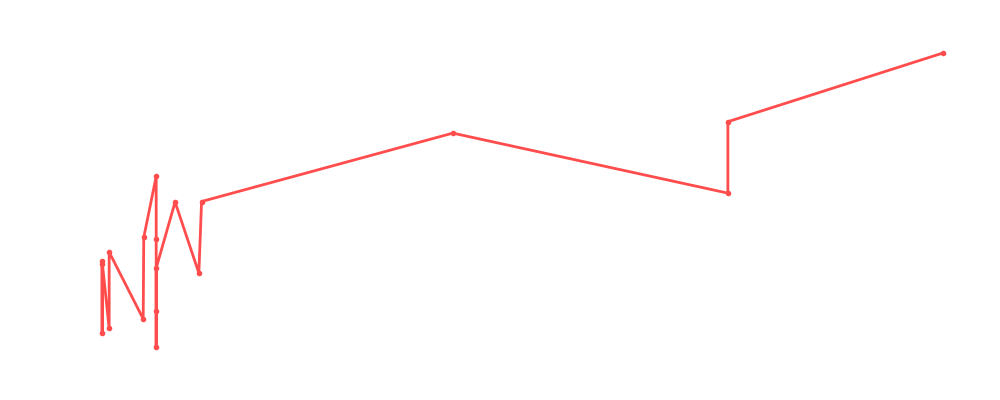

# Killshot

<table><tr><td></td><td><b>Height:</b> N/A <b>Weight:</b> N/A <b>Finisher:</b> N/A <b>Elo Rating:</b> 1233</td></tr></table>

## Karriere-Statistiken
| Matches | Siege | Niederlagen | Draws | Win % | Ø Rating | Elo |
|---|---|---|---|---|---|---|
| 25 | 10 | 9 | 6 | 40.0% | 85.56 | 1233 |

### 📈 Elo History

## Häufigste Gegner
- [[Wrestler/Bob Backlund\|Bob Backlund]] (6x)
- [[Wrestler/Tetsuya Naito\|Tetsuya Naito]] (6x)
- [[Wrestler/Madison Rayne\|Madison Rayne]] (5x)
- [[Wrestler/Big Van Vader\|Big Van Vader]] (5x)
- [[Wrestler/Rey Fenix\|Rey Fenix]] (4x)

## Häufigste Partner
- [[Wrestler/Britt Baker\|Britt Baker]] (6x)
- [[Wrestler/Edge\|Edge]] (5x)
- [[Wrestler/KENTA\|KENTA]] (5x)
- [[Wrestler/Jushin Liger\|Jushin Liger]] (3x)
- [[Wrestler/Colt Cabana\|Colt Cabana]] (3x)

## Letzte 5 Matches
- 2025-01-16: [[Teams/Saint Rebel Radicalz\|Saint Rebel Radicalz]] vs. [[Wrestler/KENTA\|KENTA]], [[Wrestler/Edge\|Edge]], & [[Wrestler/Killshot\|Killshot]]   in [[Events/2025-01-16 - S06E10_RoyalNonstop\|S06E10_RoyalNonstop]] — ✅ Win, 88%
- 2025-01-16: [[Royal Rumble]] in [[Events/2025-01-16 - S06E10_RoyalNonstop\|S06E10_RoyalNonstop]] — 🤝 Draw, 89%
- 2024-01-29: Money in the Bank No [[Ladder]] Match in [[Events/2024-01-29 - S05E12_ChokeSlamMania V\|S05E12_ChokeSlamMania V]] — 🤝 Draw, 90%
- 2023-12-15: [[Wrestler/Killshot\|Killshot]], [[Wrestler/Edge\|Edge]], & [[Wrestler/KENTA\|KENTA]] vs. [[Teams/Militanter Mummenschanz\|Militanter Mummenschanz]] in [[Events/2023-12-15 - S05E11_Tournament Nonstop Action\|S05E11_Tournament Nonstop Action]] — ✅ Win, 64%
- 2023-12-15: VF2: [[Wrestler/Edge\|Edge]], [[Wrestler/Killshot\|Killshot]], & [[Wrestler/KENTA\|KENTA]] vs. [[Teams/Saint Rebel Radicalz\|Saint Rebel Radicalz]] in [[Events/2023-12-15 - S05E11_Tournament Nonstop Action\|S05E11_Tournament Nonstop Action]] — ❌ Loss, 95%

## Top Matches
- 100%: [[Wrestler/Bam Bam Bigelow\|Bam Bam Bigelow]] & [[Wrestler/Diamond Dallas Page\|Diamond Dallas Page]] vs. [[Teams/Militanter Mummenschanz\|Militanter Mummenschanz]] in [[Events/2020-10-26 - S03E02_World Tag League\|S03E02_World Tag League]] (2020-10-26)
- 100%: [[Wrestler/Killshot\|Killshot]] vs. [[Wrestler/Colt Cabana\|Colt Cabana]] vs. [[Wrestler/Tetsuya Naito\|Tetsuya Naito]] vs. [[Wrestler/Shelton Benjamin\|Shelton Benjamin]] vs. [[Wrestler/Bob Backlund\|Bob Backlund]] vs. [[Wrestler/Shingo Takagi\|Shingo Takagi]] in [[Events/2021-04-10 - S03E07_Aussie Open Resurrection\|S03E07_Aussie Open Resurrection]] (2021-04-10)
- 96%: [[Teams/Militanter Mummenschanz\|Militanter Mummenschanz]] vs. [[Wrestler/Joe Coffey\|Joe Coffey]], [[Wrestler/Mark Coffey\|Mark Coffey]] & [[Wrestler/Wolfgang\|Wolfgang]] in [[Events/2020-12-28 - S03E03_Battle of Britain - Night 1\|S03E03_Battle of Britain - Night 1]] (2020-12-28)
- 95%: [[Wrestler/Killshot\|Killshot]] vs. [[Wrestler/Bob Backlund\|Bob Backlund]] vs. [[Wrestler/Sgt. Slaughter\|Sgt. Slaughter]] vs. [[Wrestler/Sheamus\|Sheamus]]  vs. [[Wrestler/Finn Bálor\|Finn Bálor]] in [[Events/2020-12-28 - S03E03_Battle of Britain - Pre Show\|S03E03_Battle of Britain - Pre Show]] (2020-12-28)
- 95%: [[Teams/Sweet 'n Sour Elite\|Sweet 'n Sour Elite]] vs. [[Wrestler/Killshot\|Killshot]]  , [[Wrestler/KENTA\|KENTA]], & [[Wrestler/Edge\|Edge]] in [[Events/2022-07-24 - S04E10_Überraschung\|S04E10_Überraschung]] (2022-07-24)
