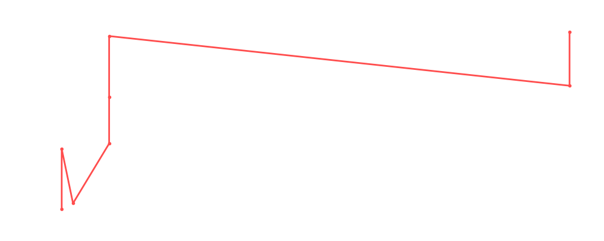

# Kota Ibushi

<table><tr><td></td><td><b>Height:</b> 181cm <b>Weight:</b> 93kg <b>Finisher:</b> Kamigoye <b>Elo Rating:</b> 1237</td></tr></table>

## Karriere-Statistiken
| Matches | Siege | Niederlagen | Draws | Win % | Ø Rating | Elo |
|---|---|---|---|---|---|---|
| 12 | 5 | 3 | 4 | 41.7% | 84.75 | 1237 |

### 📈 Elo History

## Häufigste Gegner
- [[Wrestler/Christian Cage\|Christian Cage]] (3x)
- [[Wrestler/Abdullah The Butcher\|Abdullah The Butcher]] (2x)
- [[Wrestler/Jimmy Snuka\|Jimmy Snuka]] (2x)
- [[Wrestler/Will Ospreay\|Will Ospreay]] (2x)
- [[Wrestler/Kazuchika Okada\|Kazuchika Okada]] (2x)

## Häufigste Partner
- [[Wrestler/Joey Janela\|Joey Janela]] (1x)
- [[Wrestler/Kane\|Kane]] (1x)
- [[Wrestler/Bob Backlund\|Bob Backlund]] (1x)
- [[Wrestler/Tetsuya Naito\|Tetsuya Naito]] (1x)

## Letzte 5 Matches
- 2024-09-09: D: [[Wrestler/Kota Ibushi\|Kota Ibushi]] vs. [[Wrestler/Will Ospreay\|Will Ospreay]] in [[Events/2024-09-09 - S06E06_G1 Climax - Best of the Rest from the Past\|S06E06_G1 Climax - Best of the Rest from the Past]] — ✅ Win, 83%
- 2024-09-09: D: [[Wrestler/Toru Yano\|Toru Yano]] vs. [[Wrestler/Kota Ibushi\|Kota Ibushi]] in [[Events/2024-09-09 - S06E06_G1 Climax - Best of the Rest from the Past\|S06E06_G1 Climax - Best of the Rest from the Past]] — 🤝 Draw, 85%
- 2024-09-09: D: [[Wrestler/Gunther\|Gunther]] vs. [[Wrestler/Kota Ibushi\|Kota Ibushi]] in [[Events/2024-09-09 - S06E06_G1 Climax - Best of the Rest from the Past\|S06E06_G1 Climax - Best of the Rest from the Past]] — 🤝 Draw, 80%
- 2024-09-09: D: [[Wrestler/Roman Reigns\|Roman Reigns]] vs. [[Wrestler/Kota Ibushi\|Kota Ibushi]] in [[Events/2024-09-09 - S06E06_G1 Climax - Best of the Rest from the Past\|S06E06_G1 Climax - Best of the Rest from the Past]] — ❌ Loss, 92%
- 2021-11-01: [[Wrestler/Asuka\|Asuka]] vs. [[Wrestler/Rey Mysterio\|Rey Mysterio]] Jr. vs. [[Wrestler/KUSHIDA\|KUSHIDA]]  vs. [[Wrestler/Kota Ibushi\|Kota Ibushi]] vs. [[Wrestler/Kazuchika Okada\|Kazuchika Okada]] vs. [[Wrestler/Bryan Danielson\|Bryan Danielson]] vs. [[Wrestler/Tyler Bate\|Tyler Bate]] in [[Events/2021-11-01 - S04E04_Admiral Lordevan Rules! - Part II\|S04E04_Admiral Lordevan Rules! - Part II]] — 🤝 Draw, 99%

## Top Matches
- 99%: [[Choke Slam Tag Team Championship]]: [[Wrestler/Joey Janela\|Joey Janela]] vs. [[Wrestler/Kane\|Kane]] vs. [[Wrestler/Bob Backlund\|Bob Backlund]] vs. [[Wrestler/Kota Ibushi\|Kota Ibushi]] vs. [[Wrestler/Christian Cage\|Christian Cage]] vs. [[Wrestler/Tetsuya Naito\|Tetsuya Naito]] in [[Events/2021-06-30 - S03E12_ChokeSlamMania III - Andre has a posse - Day 1\|S03E12_ChokeSlamMania III - Andre has a posse - Day 1]] (2021-06-30)
- 99%: [[Wrestler/Asuka\|Asuka]] vs. [[Wrestler/Rey Mysterio\|Rey Mysterio]] Jr. vs. [[Wrestler/KUSHIDA\|KUSHIDA]]  vs. [[Wrestler/Kota Ibushi\|Kota Ibushi]] vs. [[Wrestler/Kazuchika Okada\|Kazuchika Okada]] vs. [[Wrestler/Bryan Danielson\|Bryan Danielson]] vs. [[Wrestler/Tyler Bate\|Tyler Bate]] in [[Events/2021-11-01 - S04E04_Admiral Lordevan Rules! - Part II\|S04E04_Admiral Lordevan Rules! - Part II]] (2021-11-01)
- 92%: D: [[Wrestler/Roman Reigns\|Roman Reigns]] vs. [[Wrestler/Kota Ibushi\|Kota Ibushi]] in [[Events/2024-09-09 - S06E06_G1 Climax - Best of the Rest from the Past\|S06E06_G1 Climax - Best of the Rest from the Past]] (2024-09-09)
- 90%: Greatest Rumble ever in [[Events/2021-05-18 - S03E10_Saudi Arabia - Blood and The biggest, greatest, most awesome, most fantastic Royal Rumble ever!\|S03E10_Saudi Arabia - Blood and The biggest, greatest, most awesome, most fantastic Royal Rumble ever!]] (2021-05-18)
- 87%: Dan Koloff HC Tournament: [[Wrestler/The Butcher\|The Butcher]] vs. [[Wrestler/Kota Ibushi\|Kota Ibushi]] (M/[[Wrestler/r. Fuji\|r. Fuji]]) in [[Events/2021-07-26 - S03E12_ChokeSlamMania III - Andre has a posse - Day 2\|S03E12_ChokeSlamMania III - Andre has a posse - Day 2]] (2021-07-26)
