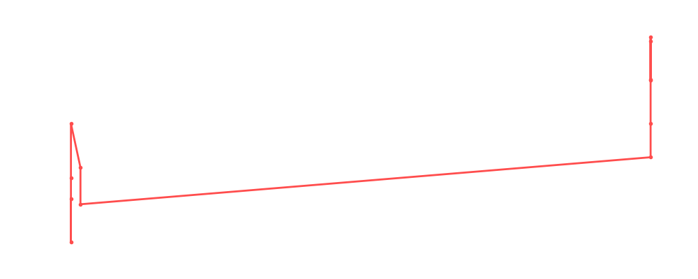

# Larry Zbyszko

<table><tr><td></td><td><b>Height:</b> N/A <b>Weight:</b> N/A <b>Finisher:</b> N/A <b>Elo Rating:</b> 1239</td></tr></table>

## Karriere-Statistiken
| Matches | Siege | Niederlagen | Draws | Win % | Ø Rating | Elo |
|---|---|---|---|---|---|---|
| 16 | 7 | 5 | 4 | 43.8% | 81.88 | 1239 |

### 📈 Elo History

## Häufigste Gegner
- [[Wrestler/CM Punk\|CM Punk]] (1x)
- [[Wrestler/Big Van Vader\|Big Van Vader]] (1x)
- [[Wrestler/Kevin Steen\|Kevin Steen]] (1x)
- [[Wrestler/Robert Dreissker\|Robert Dreissker]] (1x)
- [[Wrestler/WALTER\|WALTER]] (1x)

## Häufigste Partner
- [[Wrestler/Chris Hero\|Chris Hero]] (1x)
- [[Wrestler/Christian Cage\|Christian Cage]] (1x)
- [[Wrestler/Jeff Jarrett\|Jeff Jarrett]] (1x)

## Letzte 5 Matches
- 2024-05-27: [[Wrestler/Masha Slamovich\|Masha Slamovich]] vs. [[Wrestler/Larry Zbyszko\|Larry Zbyszko]] in [[Events/2024-05-27 - S06E04_Die beste Show der Welt\|S06E04_Die beste Show der Welt]] — 🤝 Draw, 58%
- 2024-05-27: [[Wrestler/Jordynne Grace\|Jordynne Grace]] vs. [[Wrestler/Larry Zbyszko\|Larry Zbyszko]] in [[Events/2024-05-27 - S06E04_Die beste Show der Welt\|S06E04_Die beste Show der Welt]] — ✅ Win, 77%
- 2024-05-27: [[Wrestler/Roman Reigns\|Roman Reigns]] vs. [[Wrestler/Larry Zbyszko\|Larry Zbyszko]] in [[Events/2024-05-27 - S06E04_Die beste Show der Welt\|S06E04_Die beste Show der Welt]] — ❌ Loss, 78%
- 2024-05-27: [[Wrestler/AJ Styles\|AJ Styles]] vs. [[Wrestler/Larry Zbyszko\|Larry Zbyszko]] in [[Events/2024-05-27 - S06E04_Die beste Show der Welt\|S06E04_Die beste Show der Welt]] — 🤝 Draw, 79%
- 2024-05-27: [[Wrestler/Tama Tonga\|Tama Tonga]] vs. [[Wrestler/Larry Zbyszko\|Larry Zbyszko]] in [[Events/2024-05-27 - S06E04_Die beste Show der Welt\|S06E04_Die beste Show der Welt]] — ✅ Win, 81%

## Top Matches
- 100%: [[Teams/Saint Rebel Radicalz\|Saint Rebel Radicalz]] vs. [[Wrestler/Robert Dreissker\|Robert Dreissker]] & [[Wrestler/WALTER\|WALTER]] in [[Events/2022-01-26 - S04E06_Olympia\|S04E06_Olympia]] (2022-01-26)
- 97%: SWA: [[Wrestler/Big Van Vader\|Big Van Vader]] vs. [[Wrestler/Larry Zbyszko\|Larry Zbyszko]] in [[Events/2022-01-26 - S04E06_Olympia\|S04E06_Olympia]] (2022-01-26)
- 94%: Loser leaves Town (Cage):[[Wrestler/Jeff Jarrett\|Jeff Jarrett]] vs. [[Wrestler/Marius Al-Ani\|Marius Al-Ani]] vs. [[Wrestler/Larry Zbyszko\|Larry Zbyszko]] in [[Events/2022-02-09 - S04E07_Extreme\|S04E07_Extreme]] (2022-02-09)
- 91%: Beach-Volleyball: [[Teams/Saint Rebel Radicalz\|Saint Rebel Radicalz]] vs. [[Wrestler/Damien Sandow\|Damien Sandow]] & [[Wrestler/The Sandman\|The Sandman]] in [[Events/2022-01-26 - S04E06_Olympia\|S04E06_Olympia]] (2022-01-26)
- 88%: [[Wrestler/Larry Zbyszko\|Larry Zbyszko]] vs. [[Wrestler/CM Punk\|CM Punk]]  in [[Events/2021-12-28 - S04E05_UFC\|S04E05_UFC]] (2021-12-28)
