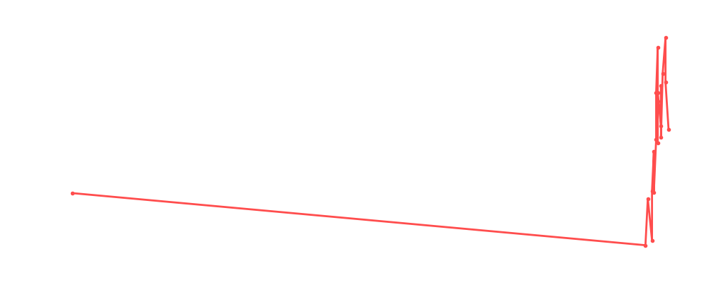

# Ludwig Kaiser

<table><tr><td></td><td><b>Height:</b> 191cm <b>Weight:</b> 85kg <b>Finisher:</b> Landungsbrücken <b>Elo Rating:</b> 1222</td></tr></table>

## Karriere-Statistiken
| Matches | Siege | Niederlagen | Draws | Win % | Ø Rating | Elo |
|---|---|---|---|---|---|---|
| 26 | 10 | 9 | 7 | 38.5% | 82.81 | 1222 |

### 📈 Elo History

## Häufigste Gegner
- [[Wrestler/Hulk Hogan\|Hulk Hogan]] (10x)
- [[Wrestler/Brandon\|Brandon]] (8x)
- [[Wrestler/AJ Styles\|AJ Styles]] (7x)
- [[Wrestler/Miro\|Miro]] (7x)
- [[Wrestler/Grayson Waller\|Grayson Waller]] (5x)

## Häufigste Partner
- [[Wrestler/Noam Dar\|Noam Dar]] (5x)
- [[Wrestler/Ikemen Jiro\|Ikemen Jiro]] (4x)
- [[Wrestler/Jonathan Gresham\|Jonathan Gresham]] (4x)
- [[Wrestler/Jay White\|Jay White]] (4x)
- [[Wrestler/Randy Savage\|Randy Savage]] (3x)

## Letzte 5 Matches
- 2024-01-29: Money in the Bank No [[Ladder]] Match in [[Events/2024-01-29 - S05E12_ChokeSlamMania V\|S05E12_ChokeSlamMania V]] — 🤝 Draw, 90%
- 2024-01-29: Los Jinetes del Aire vs. [[Teams/Sweet 'n Sour Elite\|Sweet 'n Sour Elite]] in [[Events/2024-01-29 - S05E12_ChokeSlamMania V\|S05E12_ChokeSlamMania V]] — ❌ Loss, 66%
- 2023-12-15: VF1: [[Wrestler/Chris Hero\|Chris Hero]], [[Wrestler/Shawn Michaels\|Shawn Michaels]], & [[Wrestler/Aoife Valkyrie\|Aoife Valkyrie]] vs. [[Teams/Sweet 'n Sour Elite\|Sweet 'n Sour Elite]] in [[Events/2023-12-15 - S05E11_Tournament Nonstop Action\|S05E11_Tournament Nonstop Action]] — ✅ Win, 75%
- 2023-12-15: HF2: [[Teams/Sweet 'n Sour Elite\|Sweet 'n Sour Elite]] vs. [[Wrestler/Chyna\|Chyna]], [[Wrestler/Seth Rollins\|Seth Rollins]], & [[Wrestler/Big Ryck\|Big Ryck]] in [[Events/2023-12-15 - S05E11_Tournament Nonstop Action\|S05E11_Tournament Nonstop Action]] — ❌ Loss, 81%
- 2023-12-15: [[Wrestler/EC3\|EC3]] vs. [[Wrestler/Big Van Vader\|Big Van Vader]] vs. [[Wrestler/Brutus Beefcake\|Brutus Beefcake]] vs. [[Wrestler/Tetsuya Naito\|Tetsuya Naito]] vs. [[Wrestler/Ivelisse\|Ivelisse]] vs. [[Wrestler/Tommy End\|Tommy End]] vs. [[Wrestler/Bob Backlund\|Bob Backlund]] vs. [[Wrestler/Sting\|Sting]] in [[Events/2023-12-15 - S05E11_Tournament Nonstop Action\|S05E11_Tournament Nonstop Action]] — 🤝 Draw, 88%

## Top Matches
- 101%: [[Elimination Chamber - Choke Slam World Championship]]: [[Wrestler/Mr. Fuji\|Mr. Fuji]] vs. [[Wrestler/Ludwig Kaiser\|Ludwig Kaiser]] vs. [[Wrestler/Scott Steiner\|Scott Steiner]] vs. [[Wrestler/Austin Aries\|Austin Aries]] vs. [[Wrestler/Bret Hart\|Bret Hart]] vs. [[Wrestler/Hulk Hogan\|Hulk Hogan]] (c) in [[Events/2023-10-09 - S05E09_Survivor Series - War Games\|S05E09_Survivor Series - War Games]] (2023-10-09)
- 100%: Aztec Warfare in [[Events/2023-04-19 - S05E04_Lucha Underground\|S05E04_Lucha Underground]] (2023-04-19)
- 99%: [[Choke Slam Hardcore Championship]]: [[Wrestler/Miro\|Miro]] vs. [[Wrestler/Ludwig Kaiser\|Ludwig Kaiser]] vs. [[Wrestler/Hulk Hogan\|Hulk Hogan]] vs. [[Wrestler/WALTER\|WALTER]] in [[Events/2023-02-22 - S05E02_Royal Rumble\|S05E02_Royal Rumble]] (2023-02-22)
- 98%: [[Tag Team Title]] [[Battle Royal]] in [[Events/2023-02-22 - S05E02_Royal Rumble\|S05E02_Royal Rumble]] (2023-02-22)
- 94%: What if... [[Battle Royal]] in [[Events/2023-07-30 - S05E07_What if... Japan\|S05E07_What if... Japan]] (2023-07-30)
