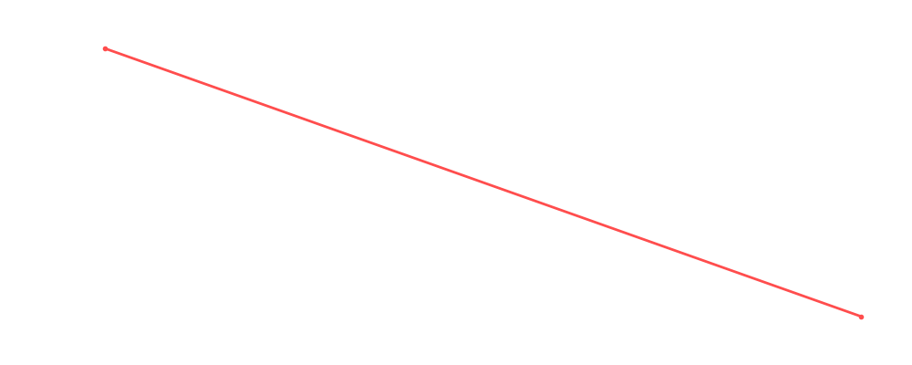

# Mascarit Sagrada

<table><tr><td></td><td><b>Height:</b> N/A <b>Weight:</b> N/A <b>Finisher:</b> N/A <b>Elo Rating:</b> 1180</td></tr></table>

## Karriere-Statistiken
| Matches | Siege | Niederlagen | Draws | Win % | Ø Rating | Elo |
|---|---|---|---|---|---|---|
| 1 | 0 | 1 | 0 | 0.0% | 73.00 | 1180 |

### 📈 Elo History

## Häufigste Gegner
- [[Wrestler/Killer Kelly\|Killer Kelly]] (1x)
- [[Wrestler/Philipp Brunkovic\|Philipp Brunkovic]] (1x)

## Häufigste Partner
- [[Wrestler/El Torito\|El Torito]] (1x)

## Letzte 5 Matches
- 2022-11-07: [[Teams/Militanter Mummenschanz\|Militanter Mummenschanz]] vs. EL Torito & [[Wrestler/Mascarit Sagrada\|Mascarit Sagrada]] in [[Events/2022-11-07 - S04E12_ChokeSlamMania IV - Day 1\|S04E12_ChokeSlamMania IV - Day 1]] — ❌ Loss, 73%

## Top Matches
- 73%: [[Teams/Militanter Mummenschanz\|Militanter Mummenschanz]] vs. EL Torito & [[Wrestler/Mascarit Sagrada\|Mascarit Sagrada]] in [[Events/2022-11-07 - S04E12_ChokeSlamMania IV - Day 1\|S04E12_ChokeSlamMania IV - Day 1]] (2022-11-07)
