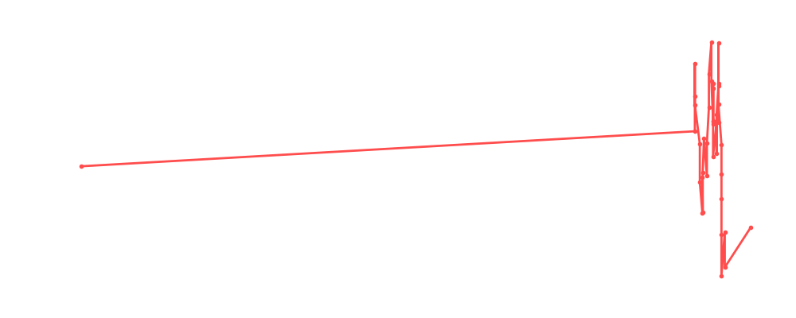

# Miro

<table><tr><td></td><td><b>Height:</b> 183cm <b>Weight:</b> 138kg <b>Finisher:</b> The Accolade <b>Elo Rating:</b> 1171</td></tr></table>

## Karriere-Statistiken
| Matches | Siege | Niederlagen | Draws | Win % | Ø Rating | Elo |
|---|---|---|---|---|---|---|
| 50 | 19 | 20 | 11 | 38.0% | 87.80 | 1171 |

### 📈 Elo History

## Häufigste Gegner
- [[Wrestler/Jay White\|Jay White]] (10x)
- [[Wrestler/AJ Styles\|AJ Styles]] (9x)
- [[Wrestler/Hulk Hogan\|Hulk Hogan]] (8x)
- [[Wrestler/Jonathan Gresham\|Jonathan Gresham]] (8x)
- [[Wrestler/Ludwig Kaiser\|Ludwig Kaiser]] (7x)

## Häufigste Partner
- [[Wrestler/Bret Hart\|Bret Hart]] (14x)
- [[Wrestler/Thea Hail\|Thea Hail]] (8x)
- [[Wrestler/CM Punk\|CM Punk]] (7x)
- [[Wrestler/Gigi Dolin\|Gigi Dolin]] (6x)
- [[Wrestler/AJ Styles\|AJ Styles]] (6x)

## Letzte 5 Matches
- 2025-01-16: [[Teams/Saint Rebel Radicalz\|Saint Rebel Radicalz]] vs. [[Wrestler/Thea Hail\|Thea Hail]], [[Wrestler/Miro\|Miro]], [[Wrestler/CM Punk\|CM Punk]], & [[Wrestler/AJ Styles\|AJ Styles]] in [[Events/2025-01-16 - S06E10_RoyalNonstop\|S06E10_RoyalNonstop]] — ✅ Win, 77%
- 2025-01-16: [[Royal Rumble]] in [[Events/2025-01-16 - S06E10_RoyalNonstop\|S06E10_RoyalNonstop]] — 🤝 Draw, 89%
- 2024-04-10: Trios [[Royal Rumble]] in [[Events/2024-04-10 - S06E03_Digital Domination: Unleash the Choke Slam Fury!\|S06E03_Digital Domination: Unleash the Choke Slam Fury!]] — 🤝 Draw, 93%
- 2024-01-29: Nature Game Masters  vs. [[Teams/Militanter Mummenschanz\|Militanter Mummenschanz]] in [[Events/2024-01-29 - S05E12_ChokeSlamMania V\|S05E12_ChokeSlamMania V]] — ❌ Loss, 92%
- 2024-01-29: Los Jinetes del Aire vs. [[Teams/Militanter Mummenschanz\|Militanter Mummenschanz]] in [[Events/2024-01-29 - S05E12_ChokeSlamMania V\|S05E12_ChokeSlamMania V]] — 🤝 Draw, 55%

## Top Matches
- 103%: [[Teams/Militanter Mummenschanz\|Militanter Mummenschanz]] vs. [[Teams/Saint Rebel Radicalz\|Saint Rebel Radicalz]] in [[Events/2023-10-09 - S05E09_Survivor Series - War Games\|S05E09_Survivor Series - War Games]] (2023-10-09)
- 102%: [[Wrestler/Grayson Waller\|Grayson Waller]] vs. [[Wrestler/Jonathan Gresham\|Jonathan Gresham]] vs. [[Wrestler/Miro\|Miro]] in [[Events/2023-02-22 - S05E02_Royal Rumble\|S05E02_Royal Rumble]] (2023-02-22)
- 100%: Aztec Warfare in [[Events/2023-04-19 - S05E04_Lucha Underground\|S05E04_Lucha Underground]] (2023-04-19)
- 99%: [[Choke Slam Hardcore Championship]]: [[Wrestler/Miro\|Miro]] vs. [[Wrestler/Ludwig Kaiser\|Ludwig Kaiser]] vs. [[Wrestler/Hulk Hogan\|Hulk Hogan]] vs. [[Wrestler/WALTER\|WALTER]] in [[Events/2023-02-22 - S05E02_Royal Rumble\|S05E02_Royal Rumble]] (2023-02-22)
- 99%: [[Teams/Militanter Mummenschanz\|Militanter Mummenschanz]] vs. [[Teams/Sweet 'n Sour Elite\|Sweet 'n Sour Elite]] in [[Events/2023-10-09 - S05E09_Survivor Series - War Games\|S05E09_Survivor Series - War Games]] (2023-10-09)
