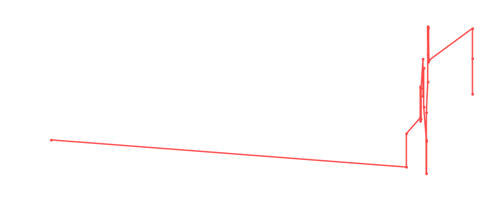

# Rey Mysterio Jr.

<table><tr><td></td><td><b>Height:</b> 167cm <b>Weight:</b> 79kg <b>Finisher:</b> Springboard Rana <b>Elo Rating:</b> 1223</td></tr></table>

## Karriere-Statistiken
| Matches | Siege | Niederlagen | Draws | Win % | Ø Rating | Elo |
|---|---|---|---|---|---|---|
| 32 | 14 | 11 | 7 | 43.8% | 82.78 | 1223 |

### 📈 Elo History

## Häufigste Gegner
- [[Wrestler/Kazuchika Okada\|Kazuchika Okada]] (4x)
- [[Wrestler/Rey Fenix\|Rey Fenix]] (4x)
- [[Wrestler/Ricky Steamboat\|Ricky Steamboat]] (4x)
- [[Wrestler/Killer Kelly\|Killer Kelly]] (4x)
- [[Wrestler/The Undertaker\|The Undertaker]] (3x)

## Häufigste Partner
- [[Wrestler/Aoife Valkyrie\|Aoife Valkyrie]] (3x)
- [[Wrestler/Christian Cage\|Christian Cage]] (3x)
- [[Wrestler/Dolph Ziggler\|Dolph Ziggler]] (2x)
- [[Wrestler/Chris Hero\|Chris Hero]] (2x)
- [[Wrestler/Randy Savage\|Randy Savage]] (1x)

## Letzte 5 Matches
- 2024-09-09: C: [[Wrestler/Rey Mysterio\|Rey Mysterio]] Jr. vs. [[Wrestler/Laredo Kid\|Laredo Kid]] in [[Events/2024-09-09 - S06E06_G1 Climax - Best of the Rest from the Past\|S06E06_G1 Climax - Best of the Rest from the Past]] — 🤝 Draw, 92%
- 2024-09-09: C: [[Wrestler/Kensuke Sasaki\|Kensuke Sasaki]] vs. [[Wrestler/Rey Mysterio\|Rey Mysterio]] Jr. in [[Events/2024-09-09 - S06E06_G1 Climax - Best of the Rest from the Past\|S06E06_G1 Climax - Best of the Rest from the Past]] — ❌ Loss, 86%
- 2024-09-09: C: [[Wrestler/Rey Mysterio\|Rey Mysterio]] Jr. vs. [[Wrestler/KUSHIDA\|KUSHIDA]] in [[Events/2024-09-09 - S06E06_G1 Climax - Best of the Rest from the Past\|S06E06_G1 Climax - Best of the Rest from the Past]] — ✅ Win, 50%
- 2024-09-09: C: [[Wrestler/The Undertaker\|The Undertaker]] vs. [[Wrestler/Rey Mysterio\|Rey Mysterio]] Jr. in [[Events/2024-09-09 - S06E06_G1 Climax - Best of the Rest from the Past\|S06E06_G1 Climax - Best of the Rest from the Past]] — ❌ Loss, 45%
- 2024-01-29: Money in the Bank No [[Ladder]] Match in [[Events/2024-01-29 - S05E12_ChokeSlamMania V\|S05E12_ChokeSlamMania V]] — 🤝 Draw, 90%

## Top Matches
- 99%: [[Wrestler/Cesaro\|Cesaro]]  vs. [[Wrestler/Dalton Castle\|Dalton Castle]] vs. [[Wrestler/Diesel\|Diesel]] vs. [[Wrestler/Kelly Klein\|Kelly Klein]] vs. [[Wrestler/The Undertaker\|The Undertaker]]  vs. [[Wrestler/The Rock\|The Rock]] vs. [[Wrestler/John Cena\|John Cena]] vs. [[Wrestler/Steve Austin\|Steve Austin]] in [[Events/2020-06-08 - S02E10_Dubai\|S02E10_Dubai]] (2020-06-08)
- 99%: [[Teams/Saint Rebel Radicalz\|Saint Rebel Radicalz]] vs. [[Teams/Militanter Mummenschanz\|Militanter Mummenschanz]] in [[Events/2021-08-23 - S04E01_90's\|S04E01_90's]] (2021-08-23)
- 99%: [[Wrestler/Asuka\|Asuka]] vs. [[Wrestler/Rey Mysterio\|Rey Mysterio]] Jr. vs. [[Wrestler/KUSHIDA\|KUSHIDA]]  vs. [[Wrestler/Kota Ibushi\|Kota Ibushi]] vs. [[Wrestler/Kazuchika Okada\|Kazuchika Okada]] vs. [[Wrestler/Bryan Danielson\|Bryan Danielson]] vs. [[Wrestler/Tyler Bate\|Tyler Bate]] in [[Events/2021-11-01 - S04E04_Admiral Lordevan Rules! - Part II\|S04E04_Admiral Lordevan Rules! - Part II]] (2021-11-01)
- 99%: [[Tables]]: [[Teams/Saint Rebel Radicalz\|Saint Rebel Radicalz]] vs. [[Wrestler/Big Dick Dudley\|Big Dick Dudley]], [[Wrestler/Buh Buh Ray Dudley\|Buh Buh Ray Dudley]], & [[Wrestler/D-Von Dudley\|D-Von Dudley]] in [[Events/2022-02-09 - S04E07_Extreme\|S04E07_Extreme]] (2022-02-09)
- 97%: [[Choke Slam Apple Championship]]: [[Wrestler/Rey Mysterio\|Rey Mysterio]] Jr. vs. [[Wrestler/Lance Storm\|Lance Storm]] in [[Events/2022-02-21 - S04E08_Fan Favourites\|S04E08_Fan Favourites]] (2022-02-21)
