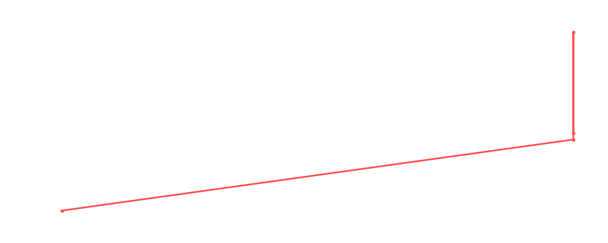

# Rhea Ripley

<table><tr><td></td><td><b>Height:</b> 173cm <b>Weight:</b> 63kg <b>Finisher:</b> Pump Handle Slam <b>Elo Rating:</b> 1212</td></tr></table>

## Karriere-Statistiken
| Matches | Siege | Niederlagen | Draws | Win % | Ø Rating | Elo |
|---|---|---|---|---|---|---|
| 5 | 2 | 1 | 2 | 40.0% | 85.60 | 1212 |

### 📈 Elo History

## Häufigste Gegner
- [[Wrestler/Kane\|Kane]] (2x)
- [[Wrestler/Ivelisse\|Ivelisse]] (2x)
- [[Wrestler/Abdullah The Butcher\|Abdullah The Butcher]] (2x)
- [[Wrestler/Jimmy Snuka\|Jimmy Snuka]] (2x)
- [[Wrestler/Michelle McCool\|Michelle McCool]] (2x)

## Letzte 5 Matches
- 2023-02-22: Womens [[Royal Rumble]] in [[Events/2023-02-22 - S05E02_Royal Rumble\|S05E02_Royal Rumble]] — 🤝 Draw, 88%
- 2021-05-18: Greatest Rumble ever in [[Events/2021-05-18 - S03E10_Saudi Arabia - Blood and The biggest, greatest, most awesome, most fantastic Royal Rumble ever!\|S03E10_Saudi Arabia - Blood and The biggest, greatest, most awesome, most fantastic Royal Rumble ever!]] — 🤝 Draw, 90%
- 2021-04-10: [[Wrestler/Rhea Ripley\|Rhea Ripley]] vs. [[Wrestler/Kane\|Kane]] in [[Events/2021-04-10 - S03E07_Aussie Open Resurrection\|S03E07_Aussie Open Resurrection]] — ✅ Win, 84%
- 2021-04-10: [[Wrestler/Rhea Ripley\|Rhea Ripley]] vs. [[Wrestler/Ivelisse\|Ivelisse]] in [[Events/2021-04-10 - S03E07_Aussie Open Resurrection\|S03E07_Aussie Open Resurrection]] — ❌ Loss, 86%
- 2021-04-10: [[Wrestler/Rhea Ripley\|Rhea Ripley]] vs. [[Wrestler/Gail Kim\|Gail Kim]] in [[Events/2021-04-10 - S03E07_Aussie Open Resurrection\|S03E07_Aussie Open Resurrection]] — ✅ Win, 80%

## Top Matches
- 90%: Greatest Rumble ever in [[Events/2021-05-18 - S03E10_Saudi Arabia - Blood and The biggest, greatest, most awesome, most fantastic Royal Rumble ever!\|S03E10_Saudi Arabia - Blood and The biggest, greatest, most awesome, most fantastic Royal Rumble ever!]] (2021-05-18)
- 88%: Womens [[Royal Rumble]] in [[Events/2023-02-22 - S05E02_Royal Rumble\|S05E02_Royal Rumble]] (2023-02-22)
- 86%: [[Wrestler/Rhea Ripley\|Rhea Ripley]] vs. [[Wrestler/Ivelisse\|Ivelisse]] in [[Events/2021-04-10 - S03E07_Aussie Open Resurrection\|S03E07_Aussie Open Resurrection]] (2021-04-10)
- 84%: [[Wrestler/Rhea Ripley\|Rhea Ripley]] vs. [[Wrestler/Kane\|Kane]] in [[Events/2021-04-10 - S03E07_Aussie Open Resurrection\|S03E07_Aussie Open Resurrection]] (2021-04-10)
- 80%: [[Wrestler/Rhea Ripley\|Rhea Ripley]] vs. [[Wrestler/Gail Kim\|Gail Kim]] in [[Events/2021-04-10 - S03E07_Aussie Open Resurrection\|S03E07_Aussie Open Resurrection]] (2021-04-10)
