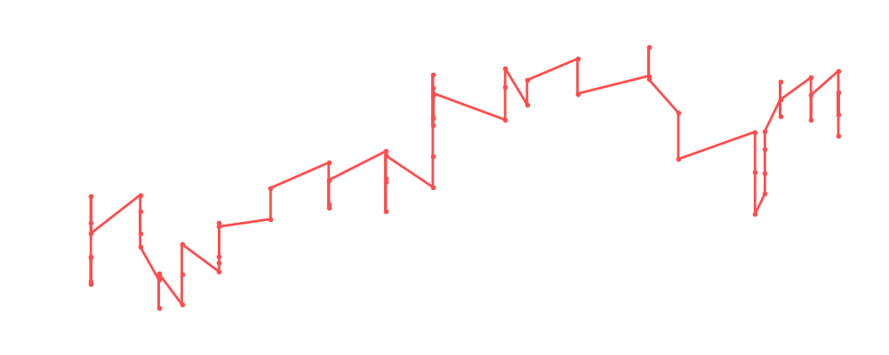

# Roman Reigns

<table><tr><td></td><td><b>Height:</b> 190cm <b>Weight:</b> 121kg <b>Finisher:</b> Spear <b>Elo Rating:</b> 1291</td></tr></table>

## Karriere-Statistiken
| Matches | Siege | Niederlagen | Draws | Win % | Ø Rating | Elo |
|---|---|---|---|---|---|---|
| 86 | 45 | 28 | 13 | 52.3% | 87.48 | 1291 |

### 📈 Elo History

## Häufigste Gegner
- [[Wrestler/Hiroshi Tanahashi\|Hiroshi Tanahashi]] (14x)
- [[Wrestler/Laredo Kid\|Laredo Kid]] (12x)
- [[Wrestler/AJ Styles\|AJ Styles]] (9x)
- [[Wrestler/The Undertaker\|The Undertaker]] (8x)
- [[Wrestler/Triple H\|Triple H]] (8x)

## Häufigste Partner
- [[Wrestler/Seth Rollins\|Seth Rollins]] (8x)
- [[Wrestler/Jon Moxley\|Jon Moxley]] (6x)
- [[Wrestler/Triple H\|Triple H]] (6x)
- [[Wrestler/Laredo Kid\|Laredo Kid]] (6x)
- [[Wrestler/Tetsuya Naito\|Tetsuya Naito]] (6x)

## Letzte 5 Matches
- 2025-10-27: [[Wrestler/Chris Benoit\|Chris Benoit]] vs. [[Wrestler/Tommaso Ciampa\|Tommaso Ciampa]] vs. [[Wrestler/Roman Reigns\|Roman Reigns]] in [[Events/2025-10-27 - S07E05_Threeway Fiasko\|S07E05_Threeway Fiasko]] — ✅ Win, 97%
- 2025-10-27: [[Wrestler/Akira Taue\|Akira Taue]] vs. [[Wrestler/Roman Reigns\|Roman Reigns]] vs. [[Wrestler/Daniel Bryan\|Daniel Bryan]] in [[Events/2025-10-27 - S07E05_Threeway Fiasko\|S07E05_Threeway Fiasko]] — ❌ Loss, 100%
- 2025-10-27: [[Wrestler/Jay White\|Jay White]] vs. [[Wrestler/Tommaso Ciampa\|Tommaso Ciampa]] vs. [[Wrestler/Roman Reigns\|Roman Reigns]] in [[Events/2025-10-27 - S07E05_Threeway Fiasko\|S07E05_Threeway Fiasko]] — ❌ Loss, 107%
- 2025-10-27: [[Choke Slam Tag Team Championship]]: [[Teams/Saint Rebel Radicalz\|Saint Rebel Radicalz]] vs. [[Teams/Militanter Mummenschanz\|Militanter Mummenschanz]] (c) in [[Events/2025-10-27 - S07E05_Threeway Fiasko\|S07E05_Threeway Fiasko]] — ✅ Win, 93%
- 2025-10-02: [[Teams/Militanter Mummenschanz\|Militanter Mummenschanz]] vs. [[Teams/Saint Rebel Radicalz\|Saint Rebel Radicalz]] in [[Events/2025-10-02 - S07E04 The Iron Chamber - Night 2\|S07E04 The Iron Chamber - Night 2]] — ✅ Win, 88%

## Top Matches
- 107%: [[Wrestler/Jay White\|Jay White]] vs. [[Wrestler/Tommaso Ciampa\|Tommaso Ciampa]] vs. [[Wrestler/Roman Reigns\|Roman Reigns]] in [[Events/2025-10-27 - S07E05_Threeway Fiasko\|S07E05_Threeway Fiasko]] (2025-10-27)
- 105%: [[Wrestler/Hiroshi Tanahashi\|Hiroshi Tanahashi]] vs. [[Wrestler/The Undertaker\|The Undertaker]] vs. [[Wrestler/Roman Reigns\|Roman Reigns]] in [[Events/2024-02-15 - S06E01_Welcome to Ta'if\|S06E01_Welcome to Ta'if]] (2024-02-15)
- 104%: [[Wrestler/Roman Reigns\|Roman Reigns]] vs. [[Wrestler/Dusty Rhodes\|Dusty Rhodes]] in [[Events/2024-02-15 - S06E01_Welcome to Ta'if\|S06E01_Welcome to Ta'if]] (2024-02-15)
- 102%: [[Choke Slam World Championship]]: [[Wrestler/AJ Styles\|AJ Styles]] vs. [[Wrestler/Roman Reigns\|Roman Reigns]] vs. [[Wrestler/Hulk Hogan\|Hulk Hogan]] (c) in [[Events/2024-01-29 - S05E12_ChokeSlamMania V\|S05E12_ChokeSlamMania V]] (2024-01-29)
- 102%: 1/8 Finals: [[Wrestler/Kevin Steen\|Kevin Steen]] vs. [[Wrestler/Roman Reigns\|Roman Reigns]] in [[Events/2025-08-12 - S07E02_King & Queen of the Ring\|S07E02_King & Queen of the Ring]] (2025-08-12)
