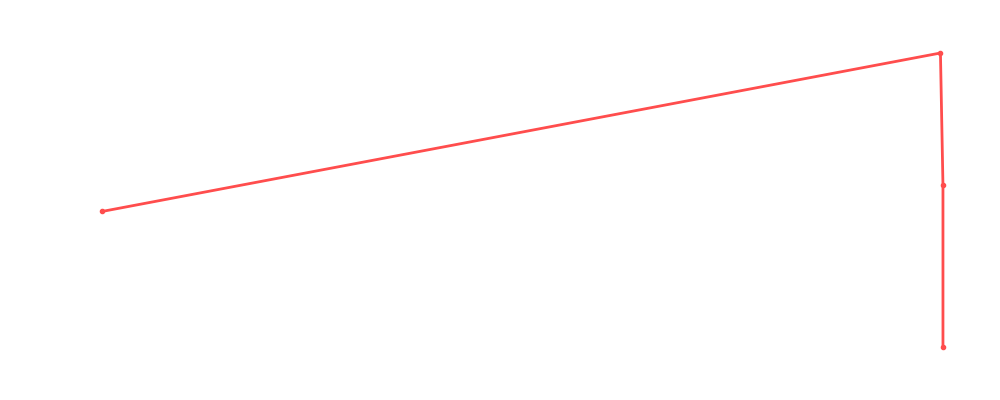

# Sgt. Slaughter

<table><tr><td></td><td><b>Height:</b> 193cm <b>Weight:</b> 141kg <b>Finisher:</b> Cobra Clutch <b>Elo Rating:</b> 1187</td></tr></table>

## Karriere-Statistiken
| Matches | Siege | Niederlagen | Draws | Win % | Ø Rating | Elo |
|---|---|---|---|---|---|---|
| 8 | 1 | 2 | 5 | 12.5% | 88.88 | 1187 |

### 📈 Elo History

## Häufigste Gegner
- [[Wrestler/Bob Backlund\|Bob Backlund]] (3x)
- [[Wrestler/Sheamus\|Sheamus]] (2x)
- [[Wrestler/Pac\|Pac]] (2x)
- [[Wrestler/Fit Finlay\|Fit Finlay]] (2x)
- [[Wrestler/Kane\|Kane]] (2x)

## Häufigste Partner
- [[Wrestler/Tetsuya Naito\|Tetsuya Naito]] (1x)

## Letzte 5 Matches
- 2021-06-30: Andre the Giant Memorial [[Battle Royal]] in [[Events/2021-06-30 - S03E12_ChokeSlamMania III - Andre has a posse - Day 1\|S03E12_ChokeSlamMania III - Andre has a posse - Day 1]] — 🤝 Draw, 89%
- 2021-05-18: Greatest Rumble ever in [[Events/2021-05-18 - S03E10_Saudi Arabia - Blood and The biggest, greatest, most awesome, most fantastic Royal Rumble ever!\|S03E10_Saudi Arabia - Blood and The biggest, greatest, most awesome, most fantastic Royal Rumble ever!]] — 🤝 Draw, 90%
- 2021-01-21: [[Iron Man]]: [[Teams/Militanter Mummenschanz\|Militanter Mummenschanz]] vs. [[Teams/Sweet 'n Sour Elite\|Sweet 'n Sour Elite]] in [[Events/2021-01-21 - S03E04_Clash of Colosseum\|S03E04_Clash of Colosseum]] — 🤝 Draw, 100%
- 2021-01-21: [[Iron Man]]: [[Teams/Saint Rebel Radicalz\|Saint Rebel Radicalz]] vs. [[Teams/Sweet 'n Sour Elite\|Sweet 'n Sour Elite]] in [[Events/2021-01-21 - S03E04_Clash of Colosseum\|S03E04_Clash of Colosseum]] — ❌ Loss, 100%
- 2021-01-21: [[Wrestler/Sgt. Slaughter\|Sgt. Slaughter]] vs. [[Wrestler/Bruno Sammartino\|Bruno Sammartino]] in [[Events/2021-01-21 - S03E04_Clash of Colosseum\|S03E04_Clash of Colosseum]] — ❌ Loss, 69%

## Top Matches
- 100%: [[Iron Man]]: [[Teams/Militanter Mummenschanz\|Militanter Mummenschanz]] vs. [[Teams/Sweet 'n Sour Elite\|Sweet 'n Sour Elite]] in [[Events/2021-01-21 - S03E04_Clash of Colosseum\|S03E04_Clash of Colosseum]] (2021-01-21)
- 100%: [[Iron Man]]: [[Teams/Saint Rebel Radicalz\|Saint Rebel Radicalz]] vs. [[Teams/Sweet 'n Sour Elite\|Sweet 'n Sour Elite]] in [[Events/2021-01-21 - S03E04_Clash of Colosseum\|S03E04_Clash of Colosseum]] (2021-01-21)
- 95%: [[Wrestler/Killshot\|Killshot]] vs. [[Wrestler/Bob Backlund\|Bob Backlund]] vs. [[Wrestler/Sgt. Slaughter\|Sgt. Slaughter]] vs. [[Wrestler/Sheamus\|Sheamus]]  vs. [[Wrestler/Finn Bálor\|Finn Bálor]] in [[Events/2020-12-28 - S03E03_Battle of Britain - Pre Show\|S03E03_Battle of Britain - Pre Show]] (2020-12-28)
- 94%: [[Wrestler/Sgt. Slaughter\|Sgt. Slaughter]] vs. [[Wrestler/Fit Finlay\|Fit Finlay]] in [[Events/2020-12-29 - S03E03_Battle of Britain - Night 2\|S03E03_Battle of Britain - Night 2]] (2020-12-29)
- 90%: Greatest Rumble ever in [[Events/2021-05-18 - S03E10_Saudi Arabia - Blood and The biggest, greatest, most awesome, most fantastic Royal Rumble ever!\|S03E10_Saudi Arabia - Blood and The biggest, greatest, most awesome, most fantastic Royal Rumble ever!]] (2021-05-18)
