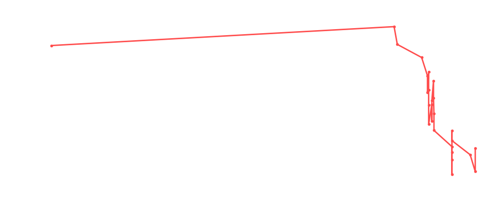

# Shawn Michaels

<table><tr><td></td><td><b>Height:</b> 185cm <b>Weight:</b> 102kg <b>Finisher:</b> Sweet Chin Music <b>Elo Rating:</b> 1111</td></tr></table>

## Karriere-Statistiken
| Matches | Siege | Niederlagen | Draws | Win % | Ø Rating | Elo |
|---|---|---|---|---|---|---|
| 30 | 8 | 17 | 5 | 26.7% | 90.03 | 1111 |

### 📈 Elo History

## Häufigste Gegner
- [[Wrestler/Bob Backlund\|Bob Backlund]] (9x)
- [[Wrestler/Big Van Vader\|Big Van Vader]] (6x)
- [[Wrestler/Bret Hart\|Bret Hart]] (6x)
- [[Wrestler/Triple H\|Triple H]] (4x)
- [[Wrestler/Kurt Angle\|Kurt Angle]] (4x)

## Häufigste Partner
- [[Wrestler/Chris Hero\|Chris Hero]] (8x)
- [[Wrestler/Diesel\|Diesel]] (7x)
- [[Wrestler/Aoife Valkyrie\|Aoife Valkyrie]] (5x)
- [[Wrestler/Kurt Angle\|Kurt Angle]] (3x)
- [[Wrestler/Triple H\|Triple H]] (2x)

## Letzte 5 Matches
- 2025-05-07: [[Wrestler/Bam Bam Bigelow\|Bam Bam Bigelow]] & [[Wrestler/Big Van Vader\|Big Van Vader]] vs. Dudes with Attitudes in [[Events/2025-05-07 - S06E12_ChokeSlamMania VI\|S06E12_ChokeSlamMania VI]] — ✅ Win, 88%
- 2025-05-07: [[Wrestler/Bret Hart\|Bret Hart]] & [[Wrestler/Owen Hart\|Owen Hart]] vs. Dudes with Attitudes in [[Events/2025-05-07 - S06E12_ChokeSlamMania VI\|S06E12_ChokeSlamMania VI]] — ❌ Loss, 94%
- 2025-01-16: [[Teams/Saint Rebel Radicalz\|Saint Rebel Radicalz]] vs. Dudes with Attitudes in [[Events/2025-01-16 - S06E10_RoyalNonstop\|S06E10_RoyalNonstop]] — ❌ Loss, 89%
- 2024-01-29: Big Van Vader Memorial [[Battle Royal]] in [[Events/2024-01-29 - S05E12_ChokeSlamMania V\|S05E12_ChokeSlamMania V]] — 🤝 Draw, 91%
- 2023-12-15: [[Wrestler/Shawn Michaels\|Shawn Michaels]] vs. [[Wrestler/Diesel\|Diesel]] vs. [[Wrestler/Tommy End\|Tommy End]] vs. [[Wrestler/Rush\|Rush]] vs. [[Wrestler/Bob Backlund\|Bob Backlund]] vs. [[Wrestler/Ric Flair\|Ric Flair]] in [[Events/2023-12-15 - S05E11_Tournament Nonstop Action\|S05E11_Tournament Nonstop Action]] — ❌ Loss, 93%

## Top Matches
- 99%: [[Choke Slam Tag Team Championship]]: [[Wrestler/Shawn Michaels\|Shawn Michaels]] & [[Wrestler/Triple H\|Triple H]] vs. [[Wrestler/Bam Bam Bigelow\|Bam Bam Bigelow]] & [[Wrestler/Big Van Vader\|Big Van Vader]] (c) in [[Events/2020-06-29 - S02E11_Shortcut to Mania\|S02E11_Shortcut to Mania]] (2020-06-29)
- 99%: [[Submission - Choke Slam World Championship]]: [[Wrestler/Shawn Michaels\|Shawn Michaels]] vs. [[Wrestler/Big Van Vader\|Big Van Vader]] vs. [[Wrestler/Bob Backlund\|Bob Backlund]] (c) in [[Events/2022-06-28 - S04E09_Royal Rumble\|S04E09_Royal Rumble]] (2022-06-28)
- 99%: [[Wrestler/Kurt Angle\|Kurt Angle]], [[Wrestler/Shawn Michaels\|Shawn Michaels]], & [[Wrestler/Booker T\|Booker T]] vs. [[Wrestler/Grand Master Sexay\|Grand Master Sexay]], [[Wrestler/Rikishi\|Rikishi]] , & [[Wrestler/Scotty 2 Hotty\|Scotty 2 Hotty]] in [[Events/2022-10-02 - S04E11_Musik\|S04E11_Musik]] (2022-10-02)
- 98%: [[Teams/Militanter Mummenschanz\|Militanter Mummenschanz]] vs. [[Wrestler/Diesel\|Diesel]] & [[Wrestler/Shawn Michaels\|Shawn Michaels]] in [[Events/2022-07-24 - S04E10_Überraschung\|S04E10_Überraschung]] (2022-07-24)
- 96%: [[Choke Slam Tag Team Championship]] in [[Events/2020-09-07 - S02E12_ChokeSlamMania II\|S02E12_ChokeSlamMania II]] (2020-09-07)
