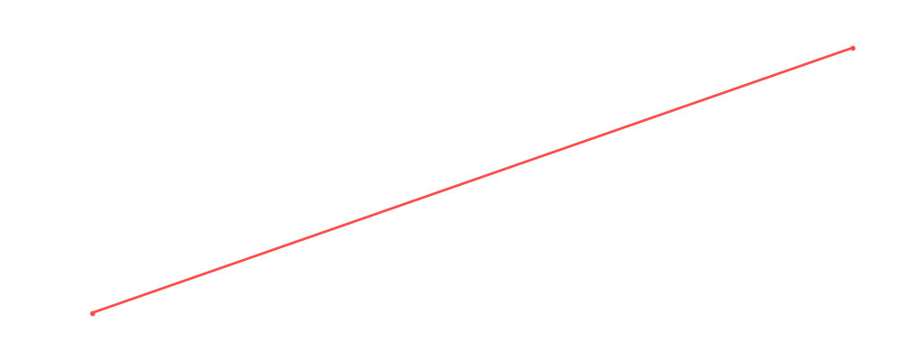

# Tatsumi Fujinami

<table><tr><td></td><td><b>Height:</b> 183cm <b>Weight:</b> 103kg <b>Finisher:</b> Dragon Sleeper <b>Elo Rating:</b> 1215</td></tr></table>

## Karriere-Statistiken
| Matches | Siege | Niederlagen | Draws | Win % | Ø Rating | Elo |
|---|---|---|---|---|---|---|
| 2 | 1 | 0 | 1 | 50.0% | 78.00 | 1215 |

### 📈 Elo History

## Häufigste Gegner
- [[Wrestler/Sara Del Rey\|Sara Del Rey]] (2x)
- [[Wrestler/Abdullah The Butcher\|Abdullah The Butcher]] (2x)
- [[Wrestler/Jimmy Snuka\|Jimmy Snuka]] (2x)
- [[Wrestler/Tiger Mask\|Tiger Mask]] (1x)
- [[Wrestler/Pat Patterson\|Pat Patterson]] (1x)

## Letzte 5 Matches
- 2021-05-18: Greatest Rumble ever in [[Events/2021-05-18 - S03E10_Saudi Arabia - Blood and The biggest, greatest, most awesome, most fantastic Royal Rumble ever!\|S03E10_Saudi Arabia - Blood and The biggest, greatest, most awesome, most fantastic Royal Rumble ever!]] — 🤝 Draw, 90%
- 2020-06-29: [[Wrestler/Tatsumi Fujinami\|Tatsumi Fujinami]] vs. [[Wrestler/Sara Del Rey\|Sara Del Rey]] in [[Events/2020-06-29 - S02E11_Shortcut to Mania\|S02E11_Shortcut to Mania]] — ✅ Win, 66%

## Top Matches
- 90%: Greatest Rumble ever in [[Events/2021-05-18 - S03E10_Saudi Arabia - Blood and The biggest, greatest, most awesome, most fantastic Royal Rumble ever!\|S03E10_Saudi Arabia - Blood and The biggest, greatest, most awesome, most fantastic Royal Rumble ever!]] (2021-05-18)
- 66%: [[Wrestler/Tatsumi Fujinami\|Tatsumi Fujinami]] vs. [[Wrestler/Sara Del Rey\|Sara Del Rey]] in [[Events/2020-06-29 - S02E11_Shortcut to Mania\|S02E11_Shortcut to Mania]] (2020-06-29)
