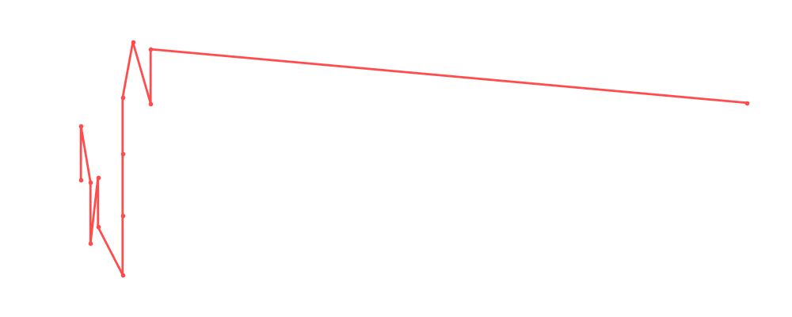

# The Butcher

<table><tr><td></td><td><b>Height:</b> N/A <b>Weight:</b> N/A <b>Finisher:</b> N/A <b>Elo Rating:</b> 1205</td></tr></table>

## Karriere-Statistiken
| Matches | Siege | Niederlagen | Draws | Win % | Ø Rating | Elo |
|---|---|---|---|---|---|---|
| 17 | 7 | 7 | 3 | 41.2% | 83.00 | 1205 |

### 📈 Elo History

## Häufigste Gegner
- [[Wrestler/Joey Janela\|Joey Janela]] (5x)
- [[Wrestler/Johnny Mundo\|Johnny Mundo]] (4x)
- [[Wrestler/Christian Cage\|Christian Cage]] (4x)
- [[Wrestler/The Blade\|The Blade]] (4x)
- [[Wrestler/Madison Rayne\|Madison Rayne]] (4x)

## Häufigste Partner
- [[Wrestler/The Blade\|The Blade]] (7x)
- [[Wrestler/Ivelisse\|Ivelisse]] (4x)
- [[Wrestler/Tetsuya Naito\|Tetsuya Naito]] (3x)
- [[Wrestler/Owen Hart\|Owen Hart]] (2x)
- [[Wrestler/Christian\|Christian]] (1x)

## Letzte 5 Matches
- 2023-12-15: [[Wrestler/Christian Cage\|Christian Cage]], [[Wrestler/The Blade\|The Blade]], & [[Wrestler/The Butcher\|The Butcher]] vs. [[Wrestler/Big Van Vader\|Big Van Vader]], [[Wrestler/Madison Rayne\|Madison Rayne]], & [[Wrestler/Triple H\|Triple H]] in [[Events/2023-12-15 - S05E11_Tournament Nonstop Action\|S05E11_Tournament Nonstop Action]] — ❌ Loss, 66%
- 2021-10-17: The Greatest [[Royal Rumble]] in [[Events/2021-10-17 - S04E03_Saudi Arabia\|S04E03_Saudi Arabia]] — 🤝 Draw, 91%
- 2021-07-26: Dan Koloff HC Tournament: [[Wrestler/The Butcher\|The Butcher]] vs. [[Wrestler/Kota Ibushi\|Kota Ibushi]] (M/[[Wrestler/r. Fuji\|r. Fuji]]) in [[Events/2021-07-26 - S03E12_ChokeSlamMania III - Andre has a posse - Day 2\|S03E12_ChokeSlamMania III - Andre has a posse - Day 2]] — ✅ Win, 87%
- 2021-07-26: Dan Koloff HC Tournament 1/2 Finals: [[Wrestler/Jeff Cobb\|Jeff Cobb]] (E/[[Wrestler/dge\|dge]]) vs. [[Wrestler/The Butcher\|The Butcher]] in [[Events/2021-07-26 - S03E12_ChokeSlamMania III - Andre has a posse - Day 2\|S03E12_ChokeSlamMania III - Andre has a posse - Day 2]] — ❌ Loss, 88%
- 2021-06-30: Dan Koloff HC Tournament: [[Wrestler/Hiromu Takahashi\|Hiromu Takahashi]] vs. [[Wrestler/The Butcher\|The Butcher]] vs. [[Wrestler/André The Giant\|André The Giant]] in [[Events/2021-06-30 - S03E12_ChokeSlamMania III - Andre has a posse - Day 1\|S03E12_ChokeSlamMania III - Andre has a posse - Day 1]] — ✅ Win, 81%

## Top Matches
- 99%: [[Wrestler/Bob Backlund\|Bob Backlund]] & [[Wrestler/Jeff Cobb\|Jeff Cobb]] vs. [[Wrestler/The Butcher\|The Butcher]] & [[Wrestler/Kazuchika Okada\|Kazuchika Okada]] in [[Events/2021-06-15 - S03E11_Sûper Canada!\|S03E11_Sûper Canada!]] (2021-06-15)
- 98%: [[Teams/Sweet 'n Sour Elite\|Sweet 'n Sour Elite]] vs. [[Wrestler/Daga\|Daga]] , [[Wrestler/Texano\|Texano]] Jr. & [[Wrestler/Rey Escorpión\|Rey Escorpión]] in [[Events/2021-04-15 - S03E08_BYOC Fiesta Mexicana\|S03E08_BYOC Fiesta Mexicana]] (2021-04-15)
- 95%: [[Teams/Sweet 'n Sour Elite\|Sweet 'n Sour Elite]] vs. Mexicans in [[Events/2021-04-15 - S03E08_BYOC Fiesta Mexicana\|S03E08_BYOC Fiesta Mexicana]] (2021-04-15)
- 95%: [[Wrestler/Joey Janela\|Joey Janela]] & [[Wrestler/The Blade\|The Blade]] vs. [[Wrestler/Owen Hart\|Owen Hart]] & [[Wrestler/The Butcher\|The Butcher]] in [[Events/2021-06-15 - S03E11_Sûper Canada!\|S03E11_Sûper Canada!]] (2021-06-15)
- 91%: [[Wrestler/Bob Backlund\|Bob Backlund]] & [[Wrestler/The Butcher\|The Butcher]] vs. [[Wrestler/Bret Hart\|Bret Hart]] & [[Wrestler/Joey Janela\|Joey Janela]] in [[Events/2021-06-15 - S03E11_Sûper Canada!\|S03E11_Sûper Canada!]] (2021-06-15)
