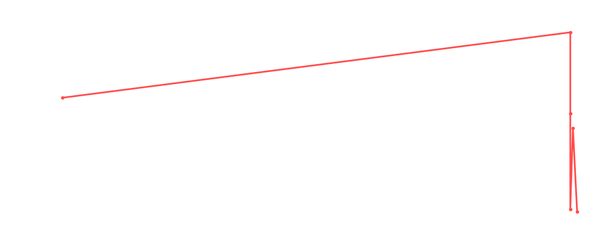

# Tiffany Stratton

<table><tr><td></td><td><b>Height:</b> N/A <b>Weight:</b> N/A <b>Finisher:</b> N/A <b>Elo Rating:</b> 1178</td></tr></table>

## Karriere-Statistiken
| Matches | Siege | Niederlagen | Draws | Win % | Ø Rating | Elo |
|---|---|---|---|---|---|---|
| 5 | 2 | 3 | 0 | 40.0% | 87.80 | 1178 |

### 📈 Elo History

## Häufigste Gegner
- [[Wrestler/Chris Hero\|Chris Hero]] (1x)
- [[Wrestler/Shawn Michaels\|Shawn Michaels]] (1x)
- [[Wrestler/Aoife Valkyrie\|Aoife Valkyrie]] (1x)
- [[Wrestler/Chyna\|Chyna]] (1x)
- [[Wrestler/Seth Rollins\|Seth Rollins]] (1x)

## Häufigste Partner
- [[Wrestler/Jonathan Gresham\|Jonathan Gresham]] (2x)
- [[Wrestler/Ludwig Kaiser\|Ludwig Kaiser]] (2x)
- [[Wrestler/Bull Nakano\|Bull Nakano]] (1x)
- [[Wrestler/Hulk Hogan\|Hulk Hogan]] (1x)
- [[Wrestler/Jay White\|Jay White]] (1x)

## Letzte 5 Matches
- 2024-04-10: [[Choke Slam Womens Championship]]: [[Wrestler/Kiana James\|Kiana James]] vs. [[Wrestler/Masha Slamovich\|Masha Slamovich]] vs. [[Wrestler/Jordynne Grace\|Jordynne Grace]] vs. [[Wrestler/Jade Cargill\|Jade Cargill]] vs. [[Wrestler/Tiffany Stratton\|Tiffany Stratton]] vs. [[Wrestler/Bianca Belair\|Bianca Belair]] in [[Events/2024-04-10 - S06E03_Digital Domination: Unleash the Choke Slam Fury!\|S06E03_Digital Domination: Unleash the Choke Slam Fury!]] — ❌ Loss, 103%
- 2024-01-29: [[Choke Slam Womens Championship]]: [[Wrestler/Sol Ruca\|Sol Ruca]] & [[Wrestler/Thea Hail\|Thea Hail]] vs. [[Wrestler/Tiffany Stratton\|Tiffany Stratton]] & [[Wrestler/Alexa Bliss\|Alexa Bliss]] (c) in [[Events/2024-01-29 - S05E12_ChokeSlamMania V\|S05E12_ChokeSlamMania V]] — ✅ Win, 94%
- 2023-12-15: VF1: [[Wrestler/Chris Hero\|Chris Hero]], [[Wrestler/Shawn Michaels\|Shawn Michaels]], & [[Wrestler/Aoife Valkyrie\|Aoife Valkyrie]] vs. [[Teams/Sweet 'n Sour Elite\|Sweet 'n Sour Elite]] in [[Events/2023-12-15 - S05E11_Tournament Nonstop Action\|S05E11_Tournament Nonstop Action]] — ✅ Win, 75%
- 2023-12-15: HF2: [[Teams/Sweet 'n Sour Elite\|Sweet 'n Sour Elite]] vs. [[Wrestler/Chyna\|Chyna]], [[Wrestler/Seth Rollins\|Seth Rollins]], & [[Wrestler/Big Ryck\|Big Ryck]] in [[Events/2023-12-15 - S05E11_Tournament Nonstop Action\|S05E11_Tournament Nonstop Action]] — ❌ Loss, 81%
- 2023-12-15: [[Teams/Sweet 'n Sour Elite\|Sweet 'n Sour Elite]] vs. [[Wrestler/Doug Williams\|Doug Williams]], [[Wrestler/Dr. Wagner\|Dr. Wagner]] Jr., [[Wrestler/Bret Hart\|Bret Hart]], & [[Wrestler/Brock Lesnar\|Brock Lesnar]] in [[Events/2023-12-15 - S05E11_Tournament Nonstop Action\|S05E11_Tournament Nonstop Action]] — ❌ Loss, 86%

## Top Matches
- 103%: [[Choke Slam Womens Championship]]: [[Wrestler/Kiana James\|Kiana James]] vs. [[Wrestler/Masha Slamovich\|Masha Slamovich]] vs. [[Wrestler/Jordynne Grace\|Jordynne Grace]] vs. [[Wrestler/Jade Cargill\|Jade Cargill]] vs. [[Wrestler/Tiffany Stratton\|Tiffany Stratton]] vs. [[Wrestler/Bianca Belair\|Bianca Belair]] in [[Events/2024-04-10 - S06E03_Digital Domination: Unleash the Choke Slam Fury!\|S06E03_Digital Domination: Unleash the Choke Slam Fury!]] (2024-04-10)
- 94%: [[Choke Slam Womens Championship]]: [[Wrestler/Sol Ruca\|Sol Ruca]] & [[Wrestler/Thea Hail\|Thea Hail]] vs. [[Wrestler/Tiffany Stratton\|Tiffany Stratton]] & [[Wrestler/Alexa Bliss\|Alexa Bliss]] (c) in [[Events/2024-01-29 - S05E12_ChokeSlamMania V\|S05E12_ChokeSlamMania V]] (2024-01-29)
- 86%: [[Teams/Sweet 'n Sour Elite\|Sweet 'n Sour Elite]] vs. [[Wrestler/Doug Williams\|Doug Williams]], [[Wrestler/Dr. Wagner\|Dr. Wagner]] Jr., [[Wrestler/Bret Hart\|Bret Hart]], & [[Wrestler/Brock Lesnar\|Brock Lesnar]] in [[Events/2023-12-15 - S05E11_Tournament Nonstop Action\|S05E11_Tournament Nonstop Action]] (2023-12-15)
- 81%: HF2: [[Teams/Sweet 'n Sour Elite\|Sweet 'n Sour Elite]] vs. [[Wrestler/Chyna\|Chyna]], [[Wrestler/Seth Rollins\|Seth Rollins]], & [[Wrestler/Big Ryck\|Big Ryck]] in [[Events/2023-12-15 - S05E11_Tournament Nonstop Action\|S05E11_Tournament Nonstop Action]] (2023-12-15)
- 75%: VF1: [[Wrestler/Chris Hero\|Chris Hero]], [[Wrestler/Shawn Michaels\|Shawn Michaels]], & [[Wrestler/Aoife Valkyrie\|Aoife Valkyrie]] vs. [[Teams/Sweet 'n Sour Elite\|Sweet 'n Sour Elite]] in [[Events/2023-12-15 - S05E11_Tournament Nonstop Action\|S05E11_Tournament Nonstop Action]] (2023-12-15)
