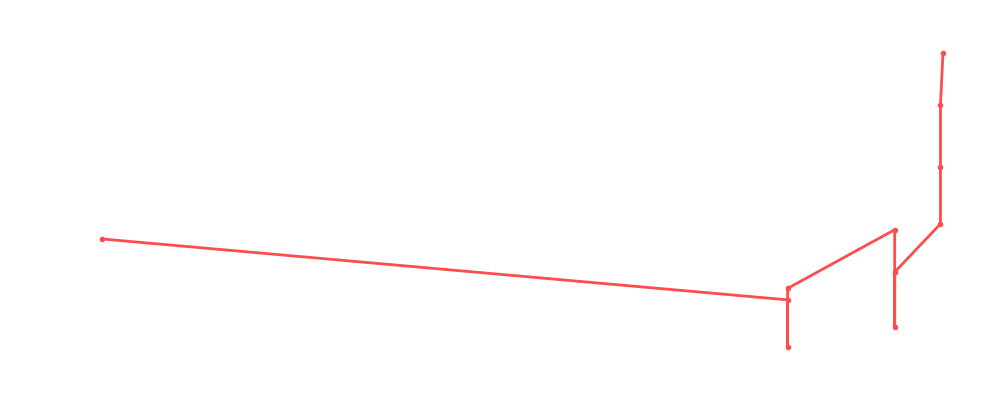

# Tyler Bate

<table><tr><td></td><td><b>Height:</b> 171cm <b>Weight:</b> 79kg <b>Finisher:</b> Tigerdriver <b>Elo Rating:</b> 1252</td></tr></table>

## Karriere-Statistiken
| Matches | Siege | Niederlagen | Draws | Win % | Ø Rating | Elo |
|---|---|---|---|---|---|---|
| 15 | 7 | 4 | 4 | 46.7% | 82.80 | 1252 |

### 📈 Elo History

## Häufigste Gegner
- [[Wrestler/Bryan Danielson\|Bryan Danielson]] (4x)
- [[Wrestler/Kazuchika Okada\|Kazuchika Okada]] (2x)
- [[Wrestler/Rey Fenix\|Rey Fenix]] (2x)
- [[Wrestler/Kurt Angle\|Kurt Angle]] (1x)
- [[Wrestler/Kane\|Kane]] (1x)

## Häufigste Partner
- [[Wrestler/Pete Dunne\|Pete Dunne]] (7x)
- [[Wrestler/Trent Seven\|Trent Seven]] (7x)

## Letzte 5 Matches
- 2025-10-02: [[Wrestler/Pete Dunne\|Pete Dunne]], [[Wrestler/Trent Seven\|Trent Seven]] & [[Wrestler/Tyler Bate\|Tyler Bate]] vs. [[Wrestler/Rey Fenix\|Rey Fenix]], [[Wrestler/Penta El Zero Miedo\|Penta El Zero Miedo]] & [[Wrestler/Pac\|Pac]] in [[Events/2025-10-02 - S07E04 The Iron Chamber - Night 2\|S07E04 The Iron Chamber - Night 2]] — ✅ Win, 87%
- 2025-09-04: Trios League: [[Teams/Saint Rebel Radicalz\|Saint Rebel Radicalz]] vs. British Strong Style in [[Events/2025-09-04 - S07E04_The Iron Chamber - Night 1\|S07E04_The Iron Chamber - Night 1]] — ✅ Win, 77%
- 2025-09-04: [[Teams/Militanter Mummenschanz\|Militanter Mummenschanz]] vs. [[Wrestler/Pete Dunne\|Pete Dunne]], [[Wrestler/Tyler Bate\|Tyler Bate]] & [[Wrestler/Trent Seven\|Trent Seven]] in [[Events/2025-09-04 - S07E04_The Iron Chamber - Night 1\|S07E04_The Iron Chamber - Night 1]] — ✅ Win, 89%
- 2025-09-04: [[Teams/Sweet 'n Sour Elite\|Sweet 'n Sour Elite]] vs. [[Wrestler/Pete Dunne\|Pete Dunne]], [[Wrestler/Trent Seven\|Trent Seven]] & [[Wrestler/Tyler Bate\|Tyler Bate]] in [[Events/2025-09-04 - S07E04_The Iron Chamber - Night 1\|S07E04_The Iron Chamber - Night 1]] — ✅ Win, 82%
- 2024-04-10: [[Wrestler/Tyler Bate\|Tyler Bate]] vs. [[Wrestler/Dijak\|Dijak]] in [[Events/2024-04-10 - S06E03_Digital Domination: Unleash the Choke Slam Fury!\|S06E03_Digital Domination: Unleash the Choke Slam Fury!]] — ❌ Loss, 73%

## Top Matches
- 99%: [[Wrestler/Bob Backlund\|Bob Backlund]] vs. [[Wrestler/Ricky Steamboat\|Ricky Steamboat]] vs. [[Wrestler/Aoife Valkyrie\|Aoife Valkyrie]] vs. [[Wrestler/Bryan Danielson\|Bryan Danielson]] vs. [[Wrestler/Tyler Bate\|Tyler Bate]] in [[Events/2021-11-01 - S04E04_Admiral Lordevan Rules! - Part II\|S04E04_Admiral Lordevan Rules! - Part II]] (2021-11-01)
- 99%: [[Wrestler/Asuka\|Asuka]] vs. [[Wrestler/Rey Mysterio\|Rey Mysterio]] Jr. vs. [[Wrestler/KUSHIDA\|KUSHIDA]]  vs. [[Wrestler/Kota Ibushi\|Kota Ibushi]] vs. [[Wrestler/Kazuchika Okada\|Kazuchika Okada]] vs. [[Wrestler/Bryan Danielson\|Bryan Danielson]] vs. [[Wrestler/Tyler Bate\|Tyler Bate]] in [[Events/2021-11-01 - S04E04_Admiral Lordevan Rules! - Part II\|S04E04_Admiral Lordevan Rules! - Part II]] (2021-11-01)
- 95%: [[Teams/Sweet 'n Sour Elite\|Sweet 'n Sour Elite]] vs. [[Wrestler/Pete Dunne\|Pete Dunne]], [[Wrestler/Trent Seven\|Trent Seven]] & [[Wrestler/Tyler Bate\|Tyler Bate]] in [[Events/2020-12-29 - S03E03_Battle of Britain - Night 2\|S03E03_Battle of Britain - Night 2]] (2020-12-29)
- 89%: [[Teams/Saint Rebel Radicalz\|Saint Rebel Radicalz]] vs. [[Wrestler/Pete Dunne\|Pete Dunne]], [[Wrestler/Trent Seven\|Trent Seven]], & [[Wrestler/Tyler Bate\|Tyler Bate]] in [[Events/2020-12-29 - S03E03_Battle of Britain - Night 2\|S03E03_Battle of Britain - Night 2]] (2020-12-29)
- 89%: [[Teams/Militanter Mummenschanz\|Militanter Mummenschanz]] vs. [[Wrestler/Pete Dunne\|Pete Dunne]], [[Wrestler/Tyler Bate\|Tyler Bate]] & [[Wrestler/Trent Seven\|Trent Seven]] in [[Events/2025-09-04 - S07E04_The Iron Chamber - Night 1\|S07E04_The Iron Chamber - Night 1]] (2025-09-04)
